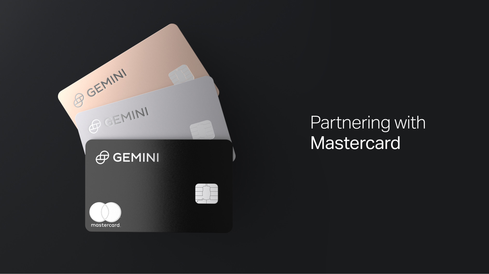

제미나이(Gemini)가 마스터카드랑 파트너로 비트코인(ETH나 UNI, DAI 등 다른 30여개 코인 중에서도 고를 수 있음)으로 캐시백되는 카드가 올 여름에 나온다고 [디크립트 기사](https://decrypt.co/69181/gemini-crypto-mastercard-unwrapped-summer)에 나왔어요.

미국 계시는 분들, 마일리지 받는 크레딧 카드 많이 사용하시죠? 저도 마일모아 같은 사이트에서 정보를 찾아보고 좋은 리워드가 있는 카드를 종종 만드는데요, 이런 마일리지 포인트는 항공사, 호텔 등에서 교환해서 사용하면 현금으로 받는 것보다 더 많은 가치를 주지요. 그런데, 모든 항공사나 호텔 등에서 사용할 수 있는 것은 아니죠. 제휴 업체에서만 사용할 수 있어서 아쉬울 때가 많습니다. 또, 해가 지날수록 포인트의 가치도 떨어지구요. 이에 비해서, 코인으로 캐시백을 받는다면 코인 자체의 가치가 상승할 수도 있고, 렌딩을 해서 이자를 벌 수도 있고, 거래소로 옮겨서 사고 팔 수도 있기 때문에 앞으로 많은 인기를 끌 수 있을거라고 생각합니다.

또, Monthly로 캐시백되는게 아니고 **돈 쓰자마자 바로! 즉각적으로 캐시백**됩니다. 기존에도 Bitpay 등 코인으로 사용하는 카드들이 몇개 나왔었는데 빗페이같은 경우는 코인을 충전해서 그만큼만 쓸수있는 카드였다면 이번 여름에 출시되는 제미나이 카드는 일반 카드처럼 **달러로 쓰고** 캐시백을 코인으로 해준다는 엄청난 차이가 있어요. 최대 3% 캐시백인데 레스토랑이 3%, 그로서리샤핑이 2%, 그 외는 1% 캐시백이라고 합니다. 캐시백받은거 제미나이에서 빌려주고 이자도 받을 수 있다고 하니 꽤나 기대가되는 카드입니다.

**여름에 카드 출시되면 다시 글 올려볼게요**

제미나이 계정이 아직 없으신 분들은 가입 후 30일내에 100불 이상 거래하면 양쪽 다 비트코인 $10씩 받는 제 리퍼럴 링크도 남길게요.

https://www.gemini.com/share/4qgkrzkcl