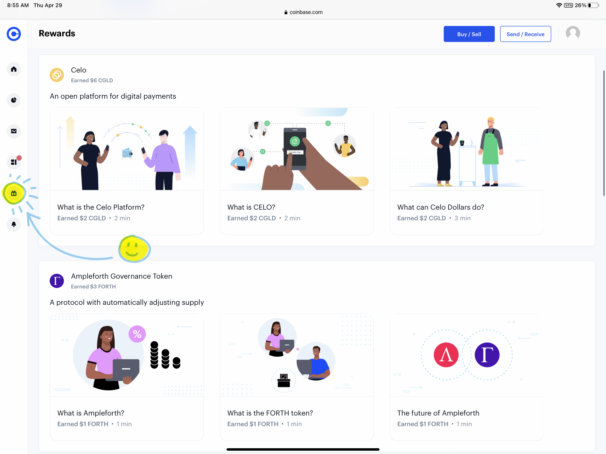
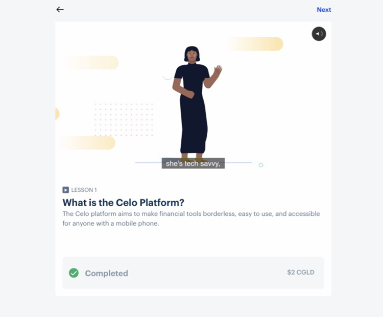

저는 개인적으로 제미나이를 더 우선으로 사용하지만 거래 가능한 코인들이 거래소마다 달라서 코인베이스 계정도 가지고 있는데요. 사실은 저도 코인 입문은 코인베이스로 했습니다.^^ 코인베이스로 입문시에 좋은 것 중 하나는 바로 무료로 코인들을 받을 수 있다는 것인데요. 

몇가지 코인들에 대해 설명해주는 비디오를 보고 퀴즈를 맞히면 선물로 해당 코인들을 받을 수 있습니다. 답이 틀려도 맞힐 때까지 해도 되니까 사실상 코인은 모두에게 다 주는 것이에요. 게다가 이 비디오들은 홍보 목적외에 교육의 목적도 있어서 봐두면 코인들을 이해하는데도 많이 도움이 됩니다. 공부도 하고 코인도 얻고 일석이조니까 아직 코인베이스 계정이 없으신 분들은 가입하시고 코인 받으세요~ 리워드 주는 코인들이 바뀔 수도 있다고 하니까 메뉴에 뜨면 바로 바로 받는게 좋겠습니다. 뭐, 얼마 안되는 금액이지만 재미있잖아요.^^

아래의 제 리퍼럴 링크를 이용해서 가입하시면 100불 이상 거래시 양쪽 모두에게 10불 상당의 비트코인이 지급됩니다.

https://www.coinbase.com/join/lee_s5c9

코인베이스는 사실 입문자용이라 사용하기는 편리하지만 수수료가 비싸다는 단점이 있으니 가입하고 공짜 코인만 받으시고 코인 매매를 하실때는 [코인베이스 프로](https://pro.coinbase.com) 로 접속하셔서 하시는게 좋아요. 둘이 같은 회사라서 계정 한번만 만들면 같은 아이디로 로그인됩니다. 모바일에서 하실 때에도 coinbase와 coinbase pro 앱이 두개로 나눠져 있습니다. 계정은 같지만, 보유 코인, 밸런스는 따로 취급된다는 점 참고하세요.