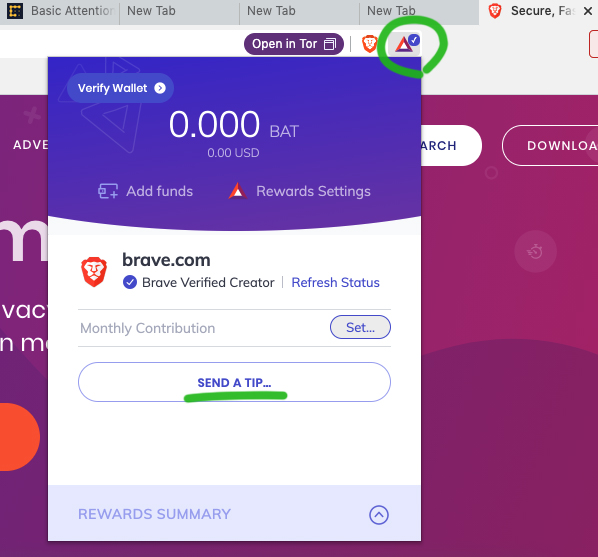

Brave 라는 브라우저 들어보셨나요? 개인정보 보호와 성능에도 굉장히 신경쓰고, 토큰 경제를 사용해서 광고를 보는 사용자들(바로 우리들)에게 일부 광고 수익을 $BAT 코인으로 돌려주는 브라우저입니다. 제가 두어달 정도 써보니까 정말 편해서 이제는 주력으로 사용하고 있는 브라우저에요. 간단하게 소개해볼게요.

요즘 온라인 개인정보 보호 문제로 말들이 많습니다. 애플은 사용자 트래킹을 막는 업데이트를 얼마 전에 내놓았고, 사용자 트래킹을 해야만 광고를 달고 수익을 얻을 수 있는 페이스북과 마찰이 많은 상황이지요. 사실, 웹서핑을 하고 있으면 쿠키 파일들이 우리 컴퓨터 상에 남아서 온라인 활동 내역을 계속해서 트래킹하고 있지요. 아무리 특정인을 지목할 수 없는 수준이라고 하지만, 여러 활동 내역을 합쳐보면 개인정보 침해의 우려가 있고, 누군가에게 항상 감시받는 듯한 느낌이라 찜찜한 것이 사실입니다. 

브레이브 브라우저는 원래 개인정보 보호 쪽에서 높은 점수를 받고 있는 파이어폭스의 창업자가 새로 만든 브라우저입니다. 아래 이미지에서 소개하고 있는 것처럼 파이어폭스보다 더 높은 수준의 개인정보 보호를 기본적으로 탑재하고 있구요, 웹사이트마다 따라다니는 트래커들을 자동으로 차단해줌으로써 웹사이트의 속도, 성능 개선도 같이 이루어집니다. 처음에는 굳이 웹브라우저를 왜 바꾸나, 또 코인을 빌미로 광고하는구나 싶었지만, 파이어폭스 창업자 [Brendan Eich](https://en.wikipedia.org/wiki/Brendan_Eich)가 만든 프로젝트라는 얘기를 듣고 믿고 사용하게 됐어요. 이 분은 무려 자바스크립트 컴퓨터 언어를 만든 사람이기도 합니다. 브레이브는 오픈 소스 크롬 엔진을 기반으로 하고 있어서 크롬을 사용하셨던 분들은 따로 적응할 것 없이 편하게 사용하실 수 있습니다.

[brave.com](https://brave.com) 에서 다운로드 받으실 수 있고, iOS 버전도 있으나 앱스토어 정책때문에 코인은 모으실 수 없습니다. ㅠㅠ 맥은 가능^^

우리가 유튜브나 페이스북같은 곳에서 광고를 보면 구글이 수익을 가져가고, 크리에이터에게도 수익 분배를 해주죠. 막상, 광고를 보는 사용자에게는 무료 컨텐츠를 볼 수 있다는 것 이외에는 돌아오는 것이 없습니다. 브레이브 브라우저는 종종 광고가 뜨고 그걸 보는 사용자들에게도 일정의 수익을 코인으로 지급해줍니다. 광고가 얼마나 자주 나오게 할건지는 브라우저 내에서 설정을 할 수 있는데 저는 최대한 많이 나오는 것으로 설정했지만 컴퓨터쓰면서 한번도 거슬린적 없어요. 새 탭을 열 때 종종 광고가 나오거나 노티피케이션 형식으로 나오기도 합니다. 굳이 광고를 클릭할 필요는 없습니다.

처음에 설치하시고, Brave Rewards Program에 동의하시면, 위의 이미지처럼 새창을 열면 항상은 아니고 종종 광고가 뜨는데 그냥 이렇게 광고페이지 본 걸로 (클릭할 필요없음) Brave Rewards인 BAT 코인이 자동으로 적립됩니다^^ 이 $BAT코인은 대부분의 거래소에서 실제 많은 사람들이 거래하고 있는 코인입니다. 

저는 설치하고도 한참동안은 리워드가 적립이 안되었어요. 온라인 포럼에도 그런 경우가 많더라구요. 그러다가 얼마전부터 적립되기 시작하더라고요. 그래서 아직까지는 코인을 많이 모으지는 못했습니다. 혹시 비슷한 문제를 겪으시게 되면 좀 기다려보시면 좋을 것 같아요. 

토큰 경제에 참여하는 모든 사람들에게 이렇게 수익을 배분해주는 시스템이 재미있습니다. 사람들의 주의력(Attention)이 가장 귀한 자원이라고 하는 세상입니다. 앞으로 브레이브 브라우저처럼 광고를 본 소비자들에게도 광고 수익이 좀 나눠지는 세상이 보편화될것 같아요. 얼마전부터는 아마존도 브레이브에서 광고를 하더라고요. 점점 이런 대형규모의 광고주들이 많아지면 BAT 코인의 가치도 점점 올라가겠죠? 왜냐하면 광고주들이 광고비를 BAT 코인으로 내기 때문이에요. $BAT는 토탈 공급량이 고정되어 있으니 수요가 늘어나면 코인의 가격도 오를 거라고 단순하게 예상해볼 수 있습니다. 물론, 코인 가격이 어떻게 될지는 아무도 예측할 수 없지만요.

만약 이런 작은 리워드에 큰 관심이 없는 분들이라면, 브레이브 크리에이터에 등록된 웹사이트 운영자들에게 매달 내가 가진 코인의 일부를 자동으로 서포트 형식으로 보내거나 일회성 팁을 선물해줄 수도 있어요. 페트리온(patreon)의 서포트 개념인데 따로 결제를 해서 돈을 보내긴 귀찮은 경우, 이렇게 광고보고 받은 코인을 팁처럼 보내줄 수 있어서 보내는 입장에선 돈이 들지 않고, 받는 입장의 크리에이터들에겐 큰 힘이 되는 서비스같아요.

요렇게 웹서핑을 하다보면 삼각형의 BAT 코인 마크가 뜨는 사이트들이 있는데 이 삼각형을 누르면 사진처럼 팁을 보내는 기능이 연결되어있어서 간편하게 후원을 하실수 있어요. 제 웹사이트도 등록을 해놓았습니다^^

또, 자동으로 팁을 보내길 원치 않으시는 경우는 위 사진처럼 브라우저 설정에서 기능을 끌 수 있습니다.

그럼 이렇게 모인 코인은 어떻게 현금화할 수 있을까요? 일단은 현재 기준으로 최소 25 $BAT 코인을 모아야 합니다. 이 최소금액은 $BAT 코인의 가치에 따라 바뀔 수도 있어요. 최소 금액 이상을 모으신 분들은 Uphold 지갑을 만들어서 코인을 옮길 수 있는데, 포럼의 글들을 보면 Uphold 지갑의 수수료 때문에 사용자들의 불만이 많다고 하네요. 현재 브레이브 팀에서 Gemini 지갑과 연동하는 업데이트를 준비 중이라고 하니 그 때까지 기다렸다가 각 서비스를 비교해보셔도 좋을 것 같네요.

다운로드 링크 다시 한번 달아드릴게요. 지금 바로 다운받아서 앞으로 인터넷 하실때는 코인도 받으세요^^

[brave.com](https://brave.com)
