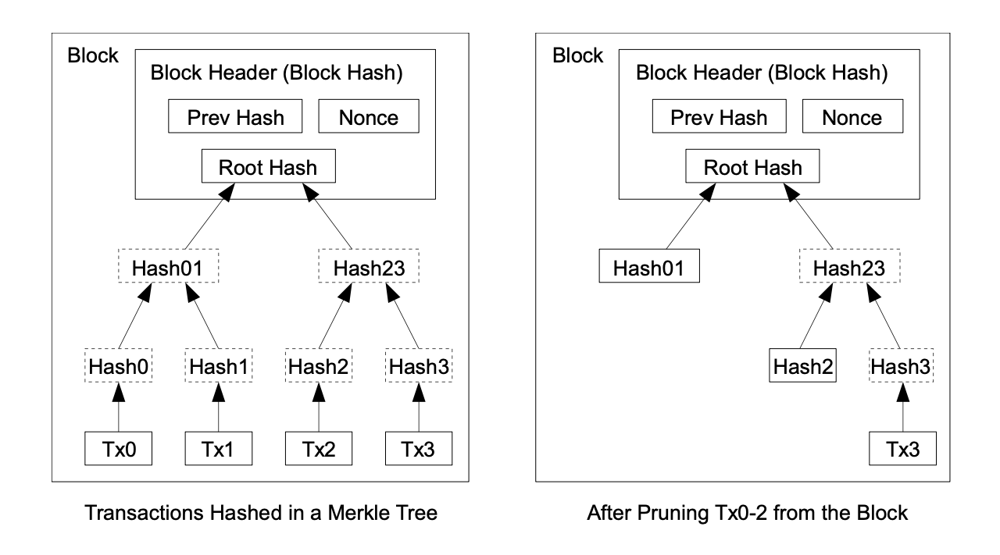
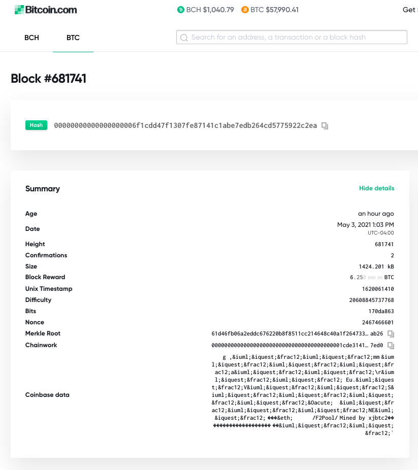
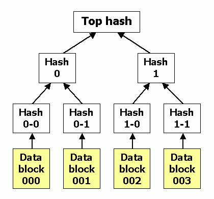
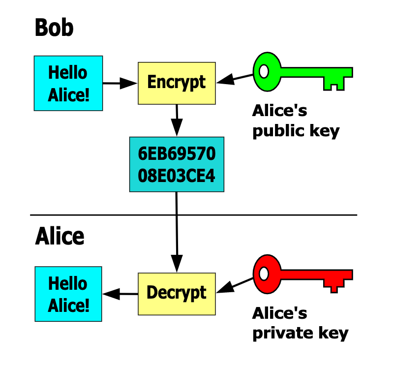

비트코인은 블록체인 기술의 첫 활용사례입니다. 금융과 공공부문에서 평생을 일해온 교수가 기술과 과학 중심의  MIT에서 블록체인을 강의하는 것이 의미가 있네요. 이 수업 자체는 MIT Sloan School of Management 경영대학에서 제공하고 있습니다. 수업을 직접 듣는 학생들에게는 컴퓨터 공학 분야의 전문가들과도 연결해줄 모양입니다. 특히, 오늘 강의는 비트코인의 기술적인 부분에 대한 내용입니다. 블록체인을 직접 만들거나 코드를 작성하지는 못하더라도 (그럴 필요가 없더라도) 이 기술이 무엇인지를 이해하는 것은 요즘같이 부풀린 말들이 오가는 상황에서 특히나 더 중요하겠습니다.

## 스터디 질문

- 블록체인을 최초로 활용한 비트코인의 디자인에는 어떤 특징들 -- 암호화, 추가만 가능한 시간이 기록된 블록, 분산화 합의 알고리듬, 네트워킹 -- 이 있는가? 앞으로 수업에서는 10가지 정도 특징들을 알아볼 예정입니다.
- 암호화 해시 함수, 비대칭 암호화, 전자서명은 무엇인가? 이들은 블록체인 기술이 증명가능하고 변경이 불가능하도록 어떻게 돕고 있는가?
- 이중 지급(double spending) 문제는 무엇이며, 블록체인 기술은 이 문제를 어떻게 해결하는가?

### 암호화 Cryptography

> Cryptography protects the communication in the presence of adversaries.

암호화는 적의를 가진 존재가 있을 때 통신을 보호한다는 교수의 설명에 컴공 박사과정에 있는 학생이 통신 뿐만 아니라 계산(computation)이 올바르게 되었는지 증명하는데도 사용된다고 말합니다.

Cryptographic Primitive라는 용어가 나옵니다. [위키피디아](https://en.wikipedia.org/wiki/Cryptographic_primitive)에 따르면, 로우-레벨 (기계어에 가까운 컴퓨터 언어를 말합니다. 인간의 언어와 비슷한 컴퓨터 언어들은 하이-레벨이라고 합니다. 웹에서 많이 쓰는 자바스크립트가 한 예입니다.) 암호화 알고리듬이라고 하네요. 특정 용도로 만들어진 것이 아니라 이를 기반으로 다양한 프로토콜을 만들 수 있도록 잘 정의되어 있어서 primitive라고 부른다고 이해하면 될 것 같습니다. 장난감 레고 블록처럼 시스템을 만들기 위한 기본적인 재료라고 볼 수도 있겠습니다.

수업에 앞서서, 겐슬러 교수가 본인의 입장을 설명하네요. 비트코인은 앞서 여러차례 실패한 암호화폐들의 문제를 해결해서 중앙 매개자가 없이 개인 간에 사용할 수 있는 화폐를 만들었습니다. 앞으로 수업에서 다루게 될 활용 사례들이 핵심인며 또 이 지점이 왜 본인이 비트코인 맥시멀리스트가 아닌지를 설명해준다고 합니다. 본인은 모든 상황에서 꼭 중앙 매개자가 나쁜 것은 아니라고 보며, 그러나 상황에 따라서는 분산화가 경쟁력이 있는 부분도 있다고 얘기합니다.

## 비트코인 디자인의 특징

> I've been working on a new electronic cash system that's fully peer to peer with no trusted third pary. -- Satoshi Nakamoto가 뉴스그룹에 남긴 글

사토시 나카모토는 페이퍼에서 "블록체인"이라는 용어를 직접적으로 사용하지는 않았습니다. "블록"과 "체인"을 따로 사용하기는 했습니다. 비트코인이 작동하기 위한 네트워크가 디자인된 방식에서 따와 2016년에야 한 단어로 사용되기 시작했다고 합니다. 

블록체인은 블록들이 계속해서 연결(체인)된 데이터베이스입니다. 거래의 시간이 기록되고 기록의 추가만 가능합니다. 새로운 블록은 약 10분마다 생성됩니다. 거래소에서 비트코인을 지갑으로 옮겨보신 분들은 시간이 좀 걸리죠? 바로 한 블록이 확인(confirmation)되기 위해 필요한 시간이 10분이기 때문입니다. 이것은 비트코인의 의도적인 디자인입니다. 이더리움은 한 블록의 완성에 약 7초가 걸립니다. 하지만 최소 내 거래가 기록된 블록 이후로 6블록 정도는 더 완성되어야 안정성을 보장받을 수 있습니다. 블록체인에서는 가장 긴 체인이 진짜 체인으로 인정받기 때문에 체인이 길어질수록 그 이전의 결과를 되돌리거나 거짓 기록을 넣기 어려워집니다. 만약, 1년 전의 거래기록을 위조하고 싶다면 그 블록을 고쳐서 다시 완성하고, 그 이후부터 오늘까지 추가된 모든 블록들을 다른 마이너들보다 더 빠르게 완성해야만, 또 앞으로도 계속해서 다른 마이너들보다 더 긴 체인을 완성해서 유지해야만 위조가 성립이 될텐데, 이는 불가능하지는 않지만 엄청나게 어려운 일이지요.

블록체인은 감사가 가능한 데이터베이스입니다. 그리고 암호화 기술을 통해 안전성을 확보합니다. 해시 함수(hash functions)는 변조를 방지(tamper resistance)하고 무결성(integrity)을 유지합니다. 전자 서명(digital signature)은 승인(consent)을 받는데 사용됩니다. 누가 기록을 하고 다음 블록을 체인에 추가할지 동의에 필요한 합의(consensus) 과정이 있습니다.

네트워크의 합의 프로토콜은 'cost of trust' 문제를 해결합니다. 앞서 강의에서 설명했던 Byzantine Generals Problem입니다. 크게 permissioned와 permissionless 네트워크로 나눠집니다.

### 기술적인 특징

- 암호화 해시 함수
- 시간이 기록된 추가만 가능한 로그 (블록)
- 블록 헤더와 머클 트리
- 비대칭 암호화와 전자 서명
- 주소
- Proof of Work를 통한 합의
- 노드로 이루어진 네트워크
- 고유의 화폐
- 거래 인풋과 아웃풋 (개인 수표에 적는 내용을 생각해보면 되겠습니다)
- 사용되지 않은 거래 아웃풋 (UTXO; Unspent Transaction Output)

## 암호화 해시 함수

### 일반적 특성

암호화에 사용되는 해시 함수(hash functions)는 데이터의 전자 지문(digital fingerprints for data)입니다. 정해지지 않은 크기의 `x`라는 인풋을 함수가 받아들여서 고정된 크기의 아웃풋으로 변환해주는데, 이걸 해시(hash)라고 부릅니다. 겐슬러 교수가 단순한 예로 드는 것은 미국 우편번호(zip code)입니다. 집코드는 각 구역별로 항상 5자리로 고정된 크기를 가지고 있습니다. 복잡한 집주소가 5자리 숫자로 압축되는 효과를 가져오죠. 유명한 베벌리힐즈의 집코드는 90210입니다. 하지만 서부지역은 9로 시작하고 동부로 갈수록 줄어드니까 어느정도는 구역을 유추해볼 수 있겠네요. 그런 의미에서 집코드는 보안용으로는 사용할 수 없겠습니다. 해시 함수의 다른 특징은 결정성(deterministic)을 가지고 있어서 같은 인풋 `x`에 대해서는 항상 같은 해시를 만들어냅니다. 해시 생성은 효율적으로 빠르게 계산할 수 있습니다.

### 암호화적 특성

- 해시 함수는 해시를 생성하는 한 방향으로만 작동(preimage resistance)합니다. 인풋 `x`를 사용하여 해시를 생성하는 것은 쉽지만 그렇게 생성된 해시를 가지고 `x`의 값을 유추해내는 것은 거의 불가능합니다. *거의* 불가능하다고 하는 이유는 브루트 포스(brute force) 방식을 사용해서 가능한 모든 옵션을 시도해볼 수 있기 때문입니다. 예를 들어 네자리 비밀번호를 잊어버렸을 때, 0000부터 9999까지 다 시도해보는 것이지요. 비트코인에 사용한 SHA-256(또는 SHA-2) 암호화 해시 알고리듬은 아직까지는 깨진 적이 없습니다. 사토시는 미래에 이 암호화 방식이 무용지물이 될 때쯤에는 더 좋은 암호화 알고리듬으로 옮겨갈 수 있을거라고 말했습니다. 이미 그 다음 단계인 [SHA-3](https://en.wikipedia.org/wiki/SHA-3)가 나와있습니다.
- 해시 함수는 또한 충돌에 저항(Collision resistant)합니다. 인풋 `x`의 해시와 다른 인풋 `y`의 해시가 같은 확률은 거의 없습니다. 
- 해시 함수는 눈사태 효과(avalanche effect)를 가지고 있습니다. 인풋 `x`의 값을 살짝만 바꾸어도 전혀 다른 해시값이 생성됩니다.
- Puzzle friendliness: 인풋 `x`의 해시값과 `x`값 자체의 일부를 알고있다고 해도 나머지 `x`값 전체를 알기는 매우 어렵습니다.

위에서 살펴본 것처럼 해시 함수는 절대적으로 안전한 것은 아닙니다. 해시를 통해 인풋을 알아낼 수 있는 확률은 1/2^128 (1 나누기 2의 128승)이라고 합니다. 2의 128승이라는 숫자가 감이 잘안오시죠? 풀어서 써보면 `340,282,366,920,938,463,463,374,607,431,768,211,456`라고 하네요. 숫자를 딱 찍었을 때, 정답일 확률이 특정한 모래알 하나를 찾을 확률보다도 낮다고 하니, 해시 함수는 굉장히 안전하다고 보면 될 것 같네요.

### 활용도

- Names
- References
- Pointers: 비트코인 블록체인에서 블록과 블록이 연결될 때 해시를 사용합니다.
- Commitments

### 비트코인에 사용된 해시 함수

- Headers & Merkle Trees (SHA-256)
- Bitcoin addresses (SHA-256 and RIPEMD160)

## 블록 헤더와 머클 트리

> Blockchain is a timestamped, append-only log

### 블록 헤더

각각의 블록 헤더에 담기는 정보는 다음과 같습니다:

- **Version:** 자주 바뀌지는 않습니다.
- **Previous block hash:** 블록들을 체인으로 연결하는데 필요한 바로 이전 블록의 해시 정보가 담깁니다.
- **Merkle root hash:** 각 블록에 담기는 거래 내역을 효율적으로 저장하기 위해 사용합니다. 머클 트리는 나뭇가지가 뻗어져있는 듯한 구조를 가지고 있습니다. 각 거래내역의 해시를 구한 다음, 이들 해시의 해시를 다시 구하면서 블록 내의 모든 거래내역들이 해시로 변환이 됩니다. 그리고 제일 상위에 있는 루트 해시 하나가 헤더에 담기게 됩니다. 우리가 풀노드(full node)로 네트워크에 참여하지 않는 이상, 모든 비트코인의 거래 히스토리를 저장하고 있지는 않습니다. 대신에, 루트 레벨의 해시가 담긴 블록 헤더를 통해 안정성을 확보받을 수 있습니다. 루트 해시 하나가 블록의 모든 거래내역을 압축해서 256비트의 숫자로 표현하고 있다고 볼 수 있습니다. 현재 전체 비트코인 블록체인의 크기는 330기가바이트 정도입니다. 하지만 일반적인 전자지갑 사용자들이 이 모든 데이터들을 다운로드받는 것은 아닙니다.
- **Timestamp:** 시간이 찍히게 됩니다. 하지만 비트코인에서 타임스탬프가 조금씩 차이가 난다고 하더라도 블록들의 순서는 정해져있기 때문에 시스템이 꼬이지는 않게 되고, 이 순서를 알 수 있는 것은 이전 블록의 해시 정보가 담겨있기 때문입니다.
- **Difficulty target:** 비트코인은 마이닝을 하는 컴퓨터 자원이 더 커질수록 블록 해시를 푸는 문제를 더 어렵게 만들도록 디자인되어있습니다. 그래서 마이너가 늘어나도 항상 한 블록을 완성하는데 10분 정도가 걸립니다. 
- **Nonce:** 논스는 무작위 수이며, 한번만 사용되는 수를 말합니다. 무작위의 수를 뽑았는데, 같은 수가 나와버리면 어떡하죠? 앞에서 본 것처럼 확률적으로 극히 드문 경우입니다. 저와 여러분이 백사장에서 모래 한 알을 주웠는데, 그게 같을 모래알일 활률이 얼마나 될까요?

### 머클 트리

> Merkle Tree is a binary data tree with hashes.

각 블록에 담기는 수천 개의 거래 내역은 위 사진과 같은 머클 트리 구조를 하고 있습니다. 제일 아래의 거래 내역에서 시작해서 위로 갈수록 그에 대한 해시를 구하면서 점점 그 리프 노드(leaf node)의 숫자가 줄어들고 나중에는 그 모든 수천 개의 거래 데이터가 하나의 루트 해시로 정리가 되는 모양이죠. 따라서 이 하나의 루트 해시가 모든 거래를 압축한다고 할 수 있습니다. 이 루트 해시가 바로 블록 헤더에 포함이 됩니다. 여기에는 또한 이 블록을 완성한 마이너에게 주는 비트코인 리워드(현재 블록 리워드는 6.25 BTC) 거래도 포함되는데, 이 블록 리워드 거래를 '코인베이스 트랜잭션(coinbase transaction)'이라고 부릅니다. 유명 거래소 코인베이스의 이름이 여기서 따온거죠. 어쨌든, 누군가 블록에 담긴 거래 중 하나를 변조하려한다면, 루트 해시가 완전하게 바뀌어버리게 됩니다. 

블록에 담기는 거래들은 어떻게 결정되나요? 먼저, 비트코인 네트워크에 참여하는 노드들이 거래 내용을 확인(verification)합니다. 확인된 거래들은 Mempool(memory pool)로 옮겨집니다. 이곳은 블록에 담기길 기다리는 데이터들의 대기실같은 곳이죠. 만약, 대기하는 거래들이 너무 많아서 멤풀 대기실이 너무 붐빈다 싶으면 최소수수료 이상을 동봉한 거래들만이 기다릴 수 있게 됩니다. 그럼 여기서 마이너들이 데이터들을 가져가서 머클 트리를 사용해서 다음 블록에 저장합니다. 

## 비대칭 암호화와 전자서명

Bob이 Alice에게 "Hello Alice!"라는 문자를 암호화해서 보내려고 합니다. 이 때 앨리스의 공개키(public key)를 이용해서 문자를 암호화(encrypt)하면 위 그림에서 보시는 것처럼, 알아볼 수 없는 해시가 생성됩니다. 이 암호를 받은 앨리스는 자신만이 알고 있는 개인키(private key)를 사용해서 암호를 해독(decrypt)하면 원문 "Hello Alice!"라는 문자를 볼 수 있게 됩니다.

공개키와 개인키는 항상 쌍으로 존재합니다. 공개키는 누구나 열람가능한 정보입니다. 하지만, 공개키를 사용해서 암호화된 해시는 앞서 해시 함수 부분에서 살펴본 것처럼 한쪽 방향으로만 작동하기 때문에 해시만 보고 원문을 유추해내는 것은 거의 불가능합니다. 이 해시를 원래 인풋으로 되돌리려면, 즉, 암호를 해독하려면, 개인키가 필요하고 이 개인키는 앨리스만 가지고 있습니다. 개인키만 있으면 공개키를 복원할 수 있지만, 공개키를 가지고는 개인키를 알아낼 수 없습니다. 암호와 해독에 두가지 다른 키를 사용하기 때문에 비대칭 암호화라고 부릅니다. 독일군의 이니그마 머신의 경우에는, 같은 기기를 사용해서 암호와 해독을 했으니 대칭 암호화 방식을 사용했네요.

비트코인 지갑 키를 잊어버려서 수백만 달러를 찾을 수 없게 된 사람들 얘기가 종종 뉴스에 나오죠? 바로 개인키를 잃어버렸기 때문에 앞서 살펴본 브루트 포스(brute force)방식으로 일일히 모든 경우의 수를 따지지 않고서는 개인키를 알 수 없게 되어버린 겁니다. 쥐메일 비밀번호를 잃어버리면 구글에 얘기해서 리셋할 수 있지만, 암호화폐 개인키를 잃어버리면 도움을 요청할 수 있는 중개인이 없습니다. 개인 키는 항상 잘 보관해야 합니다.

### 전자서명

전자서명 알고리듬은 무작위 수를 사용해서 공개키(public key)와 개인키(private key)의 쌍을 만들어냅니다. 개인키의 보관도 중요하지만, 이 두가지 키의 쌍을 어떻게 무작위로 생성하느냐도 보안과 밀접한 관련이 있습니다. 겐슬러 교수에 따르면, 많은 해지펀드들도 좋은 무작위수 생성기를 사용하지 않고 있다는 조사결과가 있다고 합니다. 각 전자지갑들이 다른 무작위수 생성기를 사용하고 있고, 이 생성기의 성능에는 차이가 난다고 합니다. 전자서명은 나만이 알고 있는 개인키와 내가 보내고 싶은 메시지를 합쳐서 만들어냅니다. 이 전자서명은 두가지 정보를 합친 암호입니다. 이 암호만 가지고는 메시지나 개인키를 알아내기가 거의 불가능합니다.

> 메시지 원본 + 보내는 이의 개인키 → 전자서명

메시지를 받은 사람이 서명이 진짜인지, 메시지가 무엇인지 확인할 때에는 보낸이의 공개키를 사용합니다. 보낸이의 공개키는 말 그대로 누구에게나 공개되어 있습니다.

> 전자서명 + 보내는 이의 공개키 → 메시지

암호화된 전자서명에 공개키를 넣는 순간 해독할 수 있게 됩니다. 정말로 보낸이가 보낸 것인지, 사칭하는 사람이 보낸 것인지의 문제는 보낸이의 공개키를 통해서 진위를 가려낼 수 있습니다. 만약 공개키와 개인키의 쌍이 맞지 않다면, 다른 말로 전자서명이 가짜라면 메시지가 제대로 해독되어 나오지 않겠지요. 수업에서 다루지는 않았지만, 메시지를 암호화할 때 받는이의 공개키를 사용해서 메시지를 암호화한다면, 받는이 이외에는 열어볼 수 없는 비밀 메시지가 만들어집니다. 

이제 중개인의 도움 없이도 암호, 복호가 가능하고 메시지의 진위를 가려낼 수 있게 되었습니다. 정말 놀랍네요!

## 비트코인 주소

공개키와 비트코인 주소를 같은 것으로 취급하는 경우가 많지만, 따지고 들어가면 같은 것은 아닙니다. 기술적인 부분을 살펴보면, 두가지 다른 해시 함수(SHA-256 and RIPEMD-160)을 사용하고 checksum(에러가 없음을 확실히 하기 위해 추가하는 데이터)을 추가하고 Base 58을 사용해서 데이터를 더 짧게 만든 것이 바로 비트코인 주소입니다. 이 모든 부차적인 과정을 통해 보안성이 높아진다네요. 기술적으로 좀 깊게 들어가는 부분이라서 일단은 그런가보다하고 넘어가겠습니다.

### 거래의 구성 방식

- Input: 지난 거래 ID, Index, 서명이 포함됩니다.
- Output: 값, 공개키(비트코인 주소)가 포함됩니다.
- 그리고 이 둘의 lock time이 포함됩니다.

---
현재 바이든 정부의 SEC 의장 개리 겐슬러 교수가 MIT에서 2018년에 블록체인과 화폐를 주제로 수업한 내용을 정리하고 있습니다. 이 요약노트는 무엇보다도 제 스스로의 공부를 위한 글입니다. 강의 내용 이외에도 제 생각들을 덧붙였기 때문에 강의 자체에 관심이 있는 분들은 원본 강의 영상을 보시길 권합니다. [강의 웹사이트](https://ocw.mit.edu/courses/sloan-school-of-management/15-s12-blockchain-and-money-fall-2018/video-lectures/)에도 영상, 리딩 등이 잘 정리되어있습니다. 강의는 [CC BY-NC-SA 라이센스](https://creativecommons.org/licenses/by-nc-sa/4.0/)로 공개되어 있습니다.

<iframe width="560" height="315" src="https://www.youtube.com/embed/0UvVOMZqpEA" title="YouTube video player" frameborder="0" allow="accelerometer; autoplay; clipboard-write; encrypted-media; gyroscope; picture-in-picture" allowfullscreen></iframe>