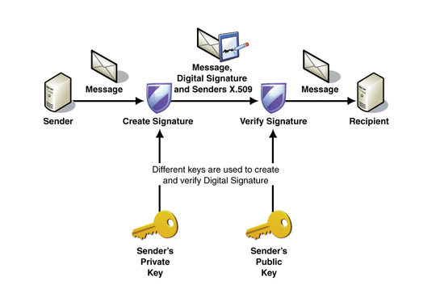
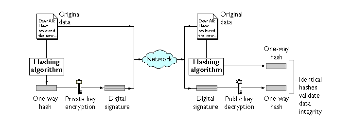

## 스터디 질문들

- 비잔틴 장군의 문제(Byzantine Gemerals Problem)는 무엇인가요? 큰 군대를 이끄는 장군이 작전에 성공하기 위해서는 모든 병력의 협력이 필요한 상황이 있습니다. 하지만, 그 중에는 악의를 가지고 있는 스파이가 있거나 소통이 힘든 인원들이 있을 때, 어떻게 명령을 잘 전달할 수 있을까요? 비트코인은 작업증명(proof-of-work)과 채굴(mining)을 통해 어떻게 이 문제를 해결할까요? 더 일반적으로 블록체인 기술은 이 문제를 어떻게 해결할까요?
- 다른 컨센서스(합의) 프로토콜에는 무엇이 있을까요? proof-of-work, proof-of-stake 등의 알고리듬들의 장단점은 무엇일까요?
- 블록체인 기술에서 분산장부를 유지하고 이중 지급(double spending)을 막기 위해서 경제적인 보상(incentives)은 어떻게 작동할까요? 컨센서스 프로토콜과 채굴의 보상은 무엇이 있을까요? 

## 블록체인 디자인 리뷰

블록체인은 시간이 기록되는 추가만 가능한 로그입니다. 추가만 가능하기 때문에 변조가 거의 불가능합니다. 수업에서는 마이닝 파워를 많이 갖는 것 이외에도 네트워크를 공격하는 방법이 있다는 학생의 코멘트가 있습니다. 비트코인은 돌아가는 네트워크, 즉 인터넷이 잘 작동할 것이라는 가정 아래 만들어졌기 때문에 인터넷의 일부가 통제되면 비트코인 네트워크의 포킹(forking; 네트워크가 어느 시점에서 가지치듯 두개로 나눠지는 것을 말합니다.)이 일어난다는 것입니다. 겐슬러 교수는 사토시의 이전 이메일을 들어 설명하기를, 인터넷의 일부가 통제되더라도 그 비율이 과반수보다 훨씬 작다면, 과반수가 넘는 메인 네트워크에 대부분의 마이닝 파워가 모일 것이며, 몇시간 정도의 적당한 시간 내에 통제받는 네트워크에서도 상황파악을 하고 마이닝을 멈출 것이라는 답변입니다.

비트코인의 기술적인 특징은 크게 3가지로 나눠서 생각해 볼 수 있습니다. 

1. 암호화, 시간이 기록된 로그: 암호화 해시 함수, 블록, 블록 헤더와 머클 트리, 비대칭적 암호화 및 전자서명, 비트코인 주소
1. 분산화 네트워크 컨센서스: 작업증명, 고유화폐, 네트워크: 오늘 강의 주제입니다.
1. 거래 스크립트 및 UTXO: 거래 인풋과 아웃풋, Unspent Transaction Output set, 스크링팅 언어: 다음 강의 주제입니다.

전자서명은 해시를 사용하는 방법(비트코인의 경우)과 해시를 사용하지 않는 방법이 있습니다. 여기서 중요한 부분은 해시를 사용해서 데이터를 압축시킬 수 있다는 것입니다.

비트코인 주소는 공개키(public key)의 해시를 만들어서 크기를 작게 하고 더 안정성을 확보한 값입니다. 개인키(private key)는 Elliptic Curve Multiplication을 사용해서 공개키를 만들어내고, 공개키는 SHA-256와 RIPEMD160 알고리듬을 사용해서 공개키 해시를 만들어냅니다. 이를 Base58 인코딩을 통해서 크기를 더 줄인 것이 비트코인 주소입니다.

> 비트코인 공개키 → 여러번의 해시 과정을 거친다 → 비트코인 주소

가장 안전하게 거래하는 방법은 거래를 할 때마다 새로 공개키/개인키 페어를 만들어서 사용하는 것이라는 견해도 있지만, 상당수의 사람들은 같은 공개키를 재사용하고 있습니다.

## 작업증명 컨센서스

### 분산화 네트워크

비잔틴 장군의 문제가 다시 나옵니다. 모든 병력이 동시에 함께 작전을 수행해야 승리할 수 있습니다. 같은 문제가 블록체인에도 적용됩니다. Permissionless 블록체인에서는 참여자들이 누군인지 모릅니다. 중앙에서 명령하는 사람도 없습니다. 이를 해결하기 위해서 컨센서스 프로토콜과 고유화폐를 사용합니다. 

### 아담 백의 해시캐시, 1997

Adam Back은 1997년 [Hashcash 시스템](https://en.wikipedia.org/wiki/Hashcash)에서 이메일 스팸과 Denial of Service(DoS)공격을 막기 위해 작업증명 방식을 제안했습니다. 이 퍼즐은 비트코인에서 사용된 것처럼 선행 제로(leading zeros: 정해진 수만큼의 0으로 시작하는 숫자)가 있는 수를 구해야만 이메일을 보낼 수 있게 되어있습니다. 간한하게 예를 들어, `007`의 경우 선행 제로가 2개 있습니다. 세자리의 수 중에서 무작위의 수를 뽑았을 때 선행제로가 2개 있을 확률은 9/999 = 1/111, 약 1%이네요. 무작위의 수를 뽑았을 때 선행제로가 1개 있을 확률은 99/999 = 11/111, 약 10%입니다. 이렇게 선행제로의 갯수를 조절하면 해시 퍼즐의 난이도를 조절할 수 있습니다. 물론, 무작위로 찍었는데 바로 퍼즐을 풀게 될 수도 있습니다.

해시캐시 시스템에서 이메일을 보내기 위해서는 이런 해시를 사용한 퍼즐을 풀어야만 합니다. 이 퍼즐은 푸는 것이 불가능하지는 않지만, 약간의 시간(이메일 하나당 2-3초)이 걸리도록 디자인되었습니다. 일반인들이 이메일 하나를 보낼 때 몇 초 정도 더 걸리는 것은 용인할 만하죠. 하지만 스패머가 수백만 이메일 스팸을 보내려고 한다면 걸리는 시간과 비용이 훨씬 커지게 됩니다. 이런 계산적인 비용이 이메일을 보내기 위한 전자우표값이라고 보면 되겠습니다. 스패머들이 우표 비용을 감당하기 힘들겠죠? 제대로 퍼즐을 풀었는지 증명하는 과정은 굉장히 빠르게 할 수 있습니다. 비트코인도 이런 과정을 넣어서 안정성을 유지합니다. 인풋의 데이터가 조금만 바뀌어도 해시는 완전히 달라지기 때문에 블록들의 연결이 깨지게 되고, 변조된 부분을 파악할 수 있습니다. [Anders Brownworth](https://andersbrownworth.com/blockchain/)의 영상과 온라인 데모가 굉장히 좋은 자료입니다.

> Blockchain - Consensus supports the longest chain

이런 수학적인 퍼즐을 풀기 위해 제일 시간과 비용을 많이 들인 블록들의 체인, 즉 가장 긴 체인을 비트코인에서는 진짜 체인이라고 받아들입니다. 여러 마이너들이 한꺼번에 채굴을 하다보면 블록체인 중간중간 갈림길이 생기기도 합니다. 하지만 결국에는 가장 긴 체인으로 주된 컴퓨터 자원과 마이너들이 모이게 됩니다. 이렇게 갈라져나와서 더 이상 채굴이 이루어지지 않는 블록을 stale block이라고 부르기도 합니다. 아래 그림에서 보라색 블록들에 해당됩니다.

앞서 잠깐 얘기했던 네트워크가 통제받는 사회에서의 포킹의 문제로 돌아가자면, 주 블록체인과 끊긴 상태에서 포킹이 된 채로 계속 채굴이 이루어지더라도 어떤 방식으로든간에 (뉴스 등의 미디어, 우편 등) 그 소식이 네트워크 바깥 현실 세계에서 전달될 것이고, 사람들은 의미없는 stale block의 채굴을 결국은 중단할 것이라는 것이 설명입니다. 마이너들이 이런 stable block을 완성하고 coinbase transaction으로 받은 비트코인은 사용을 할 수 없고(메인체인과 갈라져나왔기 때문에 거래의 흐름을 찾을 수 없겠지요), 또 비트코인 내부적으로 코인베이스 거래로 받은 비트코인은 100블록이 더 만들어질 때까지 사용이 불가능하도록 코드가 짜여져 있습니다.

만약, 중국같은 국가에서 국가적인 통제로 인터넷을 차단해서 비트코인 메인 네트워크와 연결이 끊어져어버리면 어떻게 될까요? 중국의 마이너들이 100블록 이상 포킹된 채로 채굴을 계속했다면 거기서 받은 비트코인은 가치가 있을까요? 비트코인은 이미 비트코인 캐시($BCH)로 하드 포크한 사례가 있습니다. 이 경우에는 누군가의 통제로 포킹을 한 것은 아니구요. 그렇게 포킹을 한 이후에도 사람들은 계속 비트코인 캐시를 돈을 주고 거래하고 있구요. 컨센서스가 계속 작동을 하고 있는 것이죠. 결국, 돈이라는 것은 사회적 합의이기 때문에 그렇게 포킹된 비트코인도 가치가 있다고 믿는 사람들이 여전히 존재한다면 포킹된 비트코인도 가치가 생기겠죠. 마찬가지로, 중국에서 포킹된 채로 비트코인 네트워크가 갈라져나간다면, 중국인들이 가치가 있다고 믿는 이상 '중국 비트코인'도 가치가 있을 거라고 봐야겠습니다.

### 비트코인 작업증명 난이도

- 평균 블록의 생성 시간은 10분을 목표로 합니다.
- 해시 아웃풋의 선행 제로의 갯수로 난이도를 정의합니다.
- 2,016블록마다 난이도를 조절합니다. 약 2주의 간격입니다.
- 2018년 현재, 18개의 선행 제로를 사용합니다. 해시값은 총 64개의 16진수를 사용합니다. (16진수는 숫자 0-9, 문자 A-F까지 사용합니다. 예를 들어, `09` 다음의 숫자는 `10`이 아니라 `0A`가 됩니다.)
- 비트코인 퍼즐의 난이도는 2009년 처음 시작할 때와 비교해서 수조(Trillions)배가 높아졌습니다. [그러나 항상 난이도가 높아지는 것은 아닙니다](https://www.coindesk.com/bitcoin-mining-difficulty-adjustment-down-largest-year). 2주마다 지난 2,016블록의 평균 블록 생성 시간을 보고 10분보다 짧았으면 퍼즐이 더 어려워지고, 10분보다 오래 걸렸으면 퍼즐은 더 쉽게 바뀝니다.

## 비트코인 채굴

- CPU 채굴 (2009-2010) 2-20 MH/S
- GPU 채굴 (2010-2013) 20-300 MH/S
- ASICs(Application Specific Integrated Circuit; 2013-2018) 4-16 TH/S 해시 생성에 최적화된 회로보드입니다.
- Modern Mining Factory
- Mining Pool: 2010년 경부터 시작되었습니다. 수많은 마이너들이 모여서 풀을 형성하고 서로 작업과 수익을 분담하는 구조입니다.
- 겐슬러 교수에 따르면, 채굴이 수익성을 가지기 위해서는 $0.03/kW 미만의 수준으로 전기가 공급되야 하는데, 마이너들은 전기요금이 싼 곳을 찾아야 수익이 나겠죠. 그러나 정부관리에 뇌물을 주고 전기를 사용하는 경우가 많다고 합니다. 이런 경우가 많다면, 비트코인 채굴을 위한 사회적 비용이 엄청나겠습니다. 현재도 작업증명에 사용되는 에너지 비용때문에 비트코인과 이더리움이 많은 비판을 받고 있습니다.

## 고유화폐

고유화폐(native currency) 비트코인(BTC)은 네트워크의 보상(incentive) 시스템으로 사용되고, P2P(peer-to-peer)방식으로 화폐를 만들어내는 방식이기도 합니다. 대부분의 블록체인에는 일종의 '통화 정책(monetary policies)' 이 존재해서 화폐의 공급량을 조절하고, 이 정책은 대부분 상이합니다. 

- 각 블록의 코인베이스 거래(블록 리워드)로 새로운 화폐가 생겨납니다.
- 비트코인의 핵심에 "통화 정책"이 미리 정해져 있습니다.
- 처음에는 블록 당 50 BTC가 만들어졌습니다.
- 210,000블록마다 보상은 반으로 줄어듭니다. 이를 하빙(halving)이라고 부릅니다.
- 현재는 6.25BTC가 블록마다 생성됩니다. [현재 인플레이션율](https://charts.woobull.com/bitcoin-inflation/)은 약 1.67%입니다. 인플레이션은 하빙이 될 때마다 크게 줄어듭니다.
- 2140년쯤 모든 비트코인의 생성이 끝날 예정이고, 세상에는 총 2,100만 BTC가 존재하게 됩니다. 이 정책은 코드에 바꿀 수 없도록 저장되어 있습니다.
- 겐슬러 교수는 임의로 바꿀 수 없는 디자인을 환영하는 부류도 있고, 어느정도는 사람이 조절가능해야 위기 대처에 더 효과적이라고 보는 시각도 있다고 말합니다.
- 비트코인이 화폐(cryptocurrency)의 세가지 조건--교환의 수단, 가치의 저장, 계산의 단위--을 다 갖추었는지 아니면 자산(cryptoasset)으로 봐야할지는 찬반이 엇갈립니다. 겐슬러 교수는 화폐로 기능할 수 있는 가능성도 있다(plausible)고 말합니다. 

## 네트워크

비트코인 네트워크는 다음과 같이 구성됩니다:

- **풀 노드(full nodes)**: 전체 블록체인을 저장하고 있고, 꼭 필요한 것은 아니지만 모든 거래를 확인할 수 있습니다.
- **프루닝 노드(pruning nodes)**: 거래가 확인되고 일정시간이 지나면 가지치기를 하는 노드입니다. 최근 거래내역에 집중하겠다는 얘기입니다.
- **경량 노드(lightweight nodes)**: 단순결제확인(SPV: Simplified Payment Verification) 노드. 블록체인의 헤더만을 저장합니다. 일반적인 지갑이 여기에 해당합니다.
- **채굴기(miner)**: 작업증명을 수행하고 새로운 블록을 생성합니다. 풀노드 역할을 할 필요는 없습니다. 예를 들어, 마이닝풀에 속한 채굴기는 풀 운영자에게 거래확인을 맡길 수도 있습니다. 경제학자 Nouriel Roubini는 비트코인이 충분히 분산화되어 있지 않고, 마이닝 풀이 아킬레스건이라고 본다네요. 
- **마이닝풀 운영자(mining pool operators)**
- **지갑**: 거래를 보관, 조회, 입금, 송금을 담당하고 키페어를 생성합니다. (지난 강의의 암호화 키 기억나시죠?)
- **메모리풀(mempool)**: 노드가 검증(validation)한 거래는 메모리풀로 들어갑니다. 아직 승인(confirmation)되지는 않은 거래들입니다.

## 기타 컨센서스 프로토콜

무작위로 선출되거나 또는 위임을 받은 노드들이 다음 블록을 검증합니다. 누가 다음 블록을 정하는지 결정하는 문제입니다. 검증한 블록을 승인(confirm)하는 추가 메카니즘이 있는 경우도 있습니다. 

무작위로 노드를 선택하는 방법에는 다음과 같은 것들이 있습니다.

- Proof of Stake: 고유화폐로 지분을 걸고 검증합니다.
- Proof of Activity: PoW와 PoS를 혼합한 방식입니다.
- Proof of Burn: 검증과 함께 코인을 버닝(burning)합니다.
- Proof of Capacity (Storage or Space): 하드웨어 공간에 기반합니다.

위임 방식은 노드들이 계층을 이루기도 합니다.

주요 permissionless 블록체인(2018년 수업 기준)은 아직 작업증명 방식을 사용하고 있습니다:

- [DASH](https://www.dash.org/masternodes/)는 작업증명과 계층화된 '마스터노드' 시스템을 혼합합니다. 
- [NEO](https://neo.org/)는 위임을 받은 '프로페셔널 노드(professional nodes)' 프로토콜을 사용합니다.

---
현재 바이든 정부의 SEC 의장 개리 겐슬러 교수가 MIT에서 2018년에 블록체인과 화폐를 주제로 수업한 내용을 정리하고 있습니다. 이 요약노트는 무엇보다도 제 스스로의 공부를 위한 글입니다. 강의 내용 이외에도 제 생각들을 덧붙였기 때문에 강의 자체에 관심이 있는 분들은 원본 강의 영상을 보시길 권합니다. [강의 웹사이트](https://ocw.mit.edu/courses/sloan-school-of-management/15-s12-blockchain-and-money-fall-2018/video-lectures/)에도 영상, 리딩 등이 잘 정리되어있습니다. 강의는 [CC BY-NC-SA 라이센스](https://creativecommons.org/licenses/by-nc-sa/4.0/)로 공개되어 있습니다.

<iframe width="560" height="315" src="https://www.youtube.com/embed/w7HDA8gUbpQ" title="YouTube video player" frameborder="0" allow="accelerometer; autoplay; clipboard-write; encrypted-media; gyroscope; picture-in-picture" allowfullscreen></iframe>