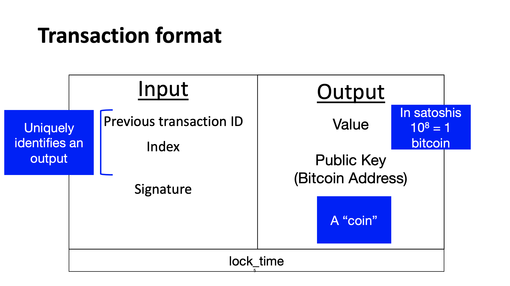

1강부터 읽으실 분들은 다음 링크에서 시작하세요: https://coinmoon.xyz/mit-blockchain-course-1/

현재 바이든 정부의 SEC 의장 개리 겐슬러 교수가 MIT에서 2018년에 블록체인과 화폐를 주제로 수업한 내용을 정리하고 있습니다. 지난 포스팅에서도 말씀드렸듯이 이 요약노트는 무엇보다도 제 스스로의 공부를 위한 글입니다. **저의 부족한 지식으로 인해 사실과 다른 내용이 있을 수도 있고, 강의 내용 이외에도 제 생각들을 덧붙였기 때문에 강의 자체에 관심이 있는 분들은 아래 원본 강의 영상을 보시길 권합니다.** [강의 웹사이트](https://ocw.mit.edu/courses/sloan-school-of-management/15-s12-blockchain-and-money-fall-2018/video-lectures/)에도 영상, 리딩 등이 잘 정리되어있습니다. 강의는 [CC BY-NC-SA 라이센스](https://creativecommons.org/licenses/by-nc-sa/4.0/)로 공개되어 있습니다.

<iframe width="560" height="315" src="https://www.youtube.com/embed/zGDTt9Q3vyM" title="YouTube video player" frameborder="0" allow="accelerometer; autoplay; clipboard-write; encrypted-media; gyroscope; picture-in-picture" allowfullscreen></iframe>

---

## 스터디 질문

- 비트코인은 어떻게 거래를 기록할까요? UTXO(unspent transaction output; 소비되지 않은 거래의 출력값)은 무엇인가요? 각각의 비트코인 거래에 포함된 스크립트 코드는 무엇이고 이 프로그래밍 언어는 얼마나 유연한가요?
- 비트코인의 많은 디자인 특성들은 비트코인 이전부터 존재했습니다. 사토시 나카모토가 새롭게 혁신한 부분은 무엇인가요?
- 사토시 나카모토의 정체는 무엇일까요?

## 거래 입력과 출력

거래 장부에는 거래를 주고 받는 양쪽이 존재합니다. 비트코인에서는 입력과 출력입니다. 

- **입력(input)**: 
  - **이전 거래 ID**: 이전 거래에서 나온 출력값입니다. 이전 거래 ID를 계속해서 따라가면 코인의 흐름을 알 수 있습니다. 결국에는 어느 불록의 코인베이스 거래(Coinbase transaction)까지 추적하게 되겠죠. 코인베이스 거래는 블록을 완성하고 채굴기가 받은 새롭게 생성된 비트코인의 첫 거래를 말합니다. 이전 강의에서 비트코인의 장부는 거래의 흐름을 따라가는 거라고 나왔었죠?
  - **인덱스**
  - **서명**
- **출력(output)**:
  - **값(value)**: 거래금액(BTC)을 말합니다. 비트코인의 최소 단위인 satoshi로 표기됩니다. (1 BTC = 0.00000001 satoshi)
  - **공개키(비트코인 주소)**: 코인이 옮겨가는 주소입니다.
- **lock time**: 기록된 락타임 이전에는 거래가 이루어지지 않습니다. 미래의 시간으로 기록해놓으면 조건부 거래를 만들 수 있습니다.

블록의 고유번호와 그 블록에 속한 거래의 고유번호만 알면 블록체인 전체에서 어떤 거래내역도 찾을 수 있습니다. 

거래에는 여러 입력값과 여러 출력값이 존재할 수도 있습니다. 예를 들어 다른 경로를 거쳐 나에게 들어온 코인들 여럿을 합쳐서 다른 여러 사람에게 나눠서 보낼 수 있습니다. (강의에서는 여러 주소로 보낼 수 있다고 하였는데, 정정이 필요한 부분입니다. 비트코인 백서에 따르면 최대 두 개의 출력을 가질 수 있다고 나옵니다. 이 두 출력은 각각, 돈을 보내는 주소, 그리고 남은 돈을 돌려받을 내 주소입니다.) 거래를 하고 남는 코인 잔액은 내 지갑으로 다시 돌려보냅니다. 잔액의 일부는 채굴기에게 수수료로 지불할 수 있습니다. 다시 정리하면,

> 입력값 ≧ 출력값

> 입력값 - 출력값 = 수수료

## 코인베이스 거래

Coinbase transaction은 채굴기에게 주어지는 각 블록의 작업증명에 대한 보상입니다. 매 210,000블록마다 하빙(1/2)이 이루어집니다. 최초의 보상은 블록 당 50비트코인이었고, 현재는 6.25비트코인이 주어집니다. 코인베이스로 받은 코인은 이후 100블록이 완성될 때까지 사용할 수 없게 되어있습니다. 일종의 안전장치입니다. 코인베이스 거래는 [3강](mit-blockchain-course-3/)에서 다뤘던 머클 트리의 가장 아래에 자리하게 됩니다. 또, 코인베이스 거래에는 임의의 100바이트 상당의 데이터를 추가할 수 있습니다. 이 공간은 추가 논스(nonce)를 위해 사용되기도 하고, 마이너들이 비밀메시지를 넣을 때 사용하기도 한다네요. 예를 들어서 최초의 블록(Genesis block)에는 다음과 같은 글이 기록되었습니다. 

> The Times 03/Jan/2009 Chancellor on brink of second bailout for banks

비트코인이 출시될 당시는 경제위기의 여파가 상당한 시기였죠. 당시의 [파이낸셜타임즈 기사](https://www.thetimes.co.uk/article/chancellor-alistair-darling-on-brink-of-second-bailout-for-banks-n9l382mn62h)의 제목이라고 합니다. 얼마전 코인베이스 거래소가 주식시장에 상장할 때에도 [비트코인 블록에 메시지](https://decrypt.co/66502/coinbase-secret-message-bitcoin-public-listing)를 넣어서 화제가 되었었죠. 이번에는 뉴욕타임즈의 판데믹구조법안에 관련한 기사제목이었습니다.

## 소비되지 않은 거래의 출력값 (UTXO) 세트

이 목록은 현재 소비되지 않은 거래들의 출력값을 모아놓은 데이터베이스입니다. 이 데이터베이스를 참고해서 거래 검증(validation)과정을 빠르게 할 수 있습니다. 재미있는 점은 이 데이터베이스는 블록체인에 저장되어있지 않다는 점입니다. 비트코인 코어에 'chainstate'라는 이름으로 LevelDB 데이터베이스 형태로 저장됩니다. 총 수천만개의 UTXO의 절반 정도는 그 금액이 너무나 작아서 '먼지(dust)' 라고 불린답니다. 이런 작은 양을 거래하려면, 수수료가 더 많이 나오기 때문에 앞으로도 사용이 되지 않을 것이라는 전망입니다.

## 스크립팅 언어

비트코인에 사용되는 스크립팅 언어는 완벽한 컴퓨터 프로그래밍 언어는 아니지만, 수백개의 작업들을 수행할 수 있습니다. 작업 범위에 한계는 있지만, 그만큼 공격범위도 줄어들기 때문에 더 안전합니다. 

- 스택(stack)에 기반한 코드로 반복문은 수행할 수 없습니다. 튜링완전어(Turing-complete)가 아니라고도 말합니다. 반면, 이더리움에서 사용하는 EVM은 튜링완전머신라서 더 복잡한 프로그램을 수행할 수 있습니다. 비트코인 스크립팅 언어가 성능이 떨어진다기보다는 의도적인 디자인라고 봐야겠습니다.
- 거래 검증과 서명인증(signature authetication)을 하기 위한 유연한 명령어 세트를 제공해줍니다.
- UTXO에서 가장 많이 쓰이는 스크립트의 종류 (출처: Perez-Sola, Delgado-Segura, et al.): 
  - **Pay-to-Pubkey-Hash**: 비트코인 주소의 해시로 보낸 거래 (81%)
  - **Pay-to-Script Hash**: 조건부 스크립트의 해시로 보낸 거래 (18%)
  - **M of N Multisig**: 다중서명을 조건으로 하는 거래 (0.7%)
  - **Pay-to-Pubkey**: 비트코인 주소로 보낸 거래 (0.1%)

## 비트코인의 혁신

비트코인에 사용된 많은 기술들--해시 함수, 작업증명 등--은 이미 나와있는 기술이었지만, 사토시 나카모토는 이 모든 것을 한데 합쳐서 비트코인을 만들어냈습니다. 이렇게 적절한 기술적인 개념들을 한데 모아서 보상에 기반한 컨센서스를 통해 중앙 매개자없이 개인간 거래가 가능한 최초로 성공적인 암호화폐를 만들었다는 것이 헉신이라고 할 수 있겠습니다. 보상이라는 개념을 도입해서 서로 정체를 알 수 없는 네트워크 참여자들이 안전한 네트워크를 만들고, 믿고 사용할 수 있게 했다는 점이 저는 개인적으로 무척이나 놀랍습니다.
 
