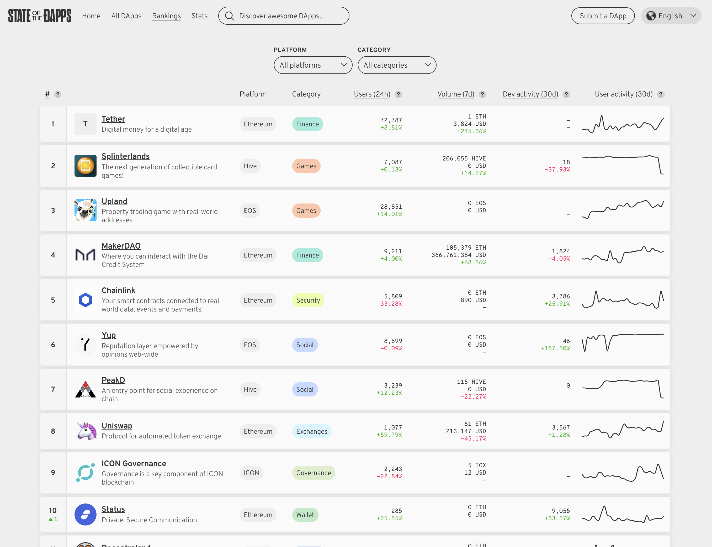

1강부터 읽으실 분들은 다음 링크에서 시작하세요: [1강 링크 바로가기](https://coinmoon.xyz/mit-blockchain-course-1/)

<iframe width="560" height="315" src="https://www.youtube.com/embed/JPkgJwJHYSc" title="YouTube video player" frameborder="0" allow="accelerometer; autoplay; clipboard-write; encrypted-media; gyroscope; picture-in-picture" allowfullscreen></iframe>

---

오늘 강의에는 Lawrence Lessig 하버드 법대 교수가 초대연사로 겐슬러 교수와 같이 강의합니다.
 
## 스터디 질문

- 스마트 컨트렉트는 무엇인가요? 기존의 컨트렉트와 어떻게 비교할 수 있을까요? 토큰은 무엇인가요?
- 이더리움(Ethereum)과 같은 스마트 컨트렉트 플랫폼은 무엇인가요? 비트코인과 어떤 점이 다른가요?
- 분산화 응용프로그램(Dapps; decentralized applications)는 무엇인가요? 어떤 용도로 사용되고 있으며 왜 아직까지 대중화가 되지 못했을까요?

## 스마트 컨트렉트

> "A set or promises, specified in digital form, including protocols within which the parties perform on these promises" --Nick Szabo, 1996

스마트 컨트렉트는 디지털 형태로 기록된 약속들의 집합으로 규약들을 포험하며 구성원들이 이 약속에 기반에 작업을 수행합니다. 여기서 '스마트'하다는 것은 인공지능의 느낌이 아니라 미리 짜여진 조건에 맞춰서 프로그램을 수행한다는 의미입니다. 또, 컨트렉트라고 부르기는 하지만 일반적인 개념의 계약은 아닐 수도 있습니다.

### 비트코인과 비교

지난 강의들에서 비트코인의 기술적인 특징을 세가지로 나눠서 살펴봤습니다. 암호화, 분산화 네트워크의 합의과정(consensus) 그리고 트랜젝션 스크립트/UTXO이었지요. 이더리움도 세부사항은 다르지만 암호화와 컨센서스를 갖추고 있습니다. 하지만 트랜젝션 스크립트와 UTXO는 존재하지 않습니다. 

- 트랜젝션 입력과 출력 (x) → 상태 변화(state transitions)
- 소비되지 않은 거래 출력값(UTXO) 세트 → 계정 기반 (잔액 기반)
- 스크립트 언어 → 7가지 사용가능 언어

### 디자인 비교

|           |     비트코인    |     이더리움     |
| :-------- | :------------ | :------------ |
| 창시자      | 사토시         | 비탈릭           |
| 창시일      | 2009년 1월    | 2015년 7월      |
| 코드       | 스크립트(non Turing) | Solidity, Serpent, LLL, Mutan (Turing complete) |
| 장부       | UTXO/트랜젝션    | 상태/계정 기반   |
| 머클트리    | 거래            | 거래, 상태, 저장소(storage), 영수증(nonce를 사용)         |
| 블록 생성 시간 | 10분         | 14초            |
| 컨센서스    | 작업증명        | 작업증명          |
| 해시 함수   | SHA-256       | Ethash          |
| 화폐      | Bitcoin(BTC)  | Ether(ETH)      |
| 채굴      | ASIC          | GPU             |
| 해시 속도   | 54 Exahash/s  | 260 Terahash/s |
| Pre-sale  | 해당없음        | ICO & 7,200만 ETH 초기배포              |
| 블록 리워드  | 6.25 BTC     | 2 ETH (2021년 5월 기준)                 |
| 통화정책    | 210,000블록마다 하빙(1/2) 약 4년 단위 | 고정. 업데이트를 통해 변화. |
| 수수료      | 자발적         | 필수, 시장가격 형성  |

### 스마트 컨트렉트를 사용하는 블록체인 플랫폼

- 이더리움, 2015
- EOS, 2016
- NEO, 2016
- 이더리움 클래식 (ETC), 2016
- LISK, 2016
- Stratis, 2017
- (현재는 그외에도 무수히 많은 블록체인 프로젝트들이 나왔지요.)

### 스마트 컨트렉트의 잠재 활용도

- 디지털 신원 (기록)
- 유가증권 (금융 거래)
- 파생상품 (재정 데이터)
- 주택 융자 (부동산 명의)
- 물류 체인 (자동차 보험)
- 임상 실험 (암 연구)

## 분산화 앱(Dapps)과 토큰 세일

### 뎁스

- 분산화 블록체인 네트워크에서 실행되는 애플리케이션을 말합니다.
- 보통 고유 토큰이 있고 플랫폼 위에서 스마트 컨트렉트 형태로 실행됩니다.

[State of the Dapps 웹사이트](https://www.stateofthedapps.com/)에 현재 뎁스 관련 현황들이 잘 정리되어있습니다.

### 가상통화공개(ICO; Initial Coin Offerings)

- ICO를 통해 네트워크를 만들기 위한 비용을 모금합니다.
- 여기서 이슈되는 토큰은 아직 사용가능하지 않은 경우가 많습니다. 
- 개발은 오픈소스이지만 대부분 중앙화되어있습니다. 
- 주최자는 미리 만들어진(premined) 토큰을 일정량 스스로에게 배당해놓습니다. 이더리움의 경우, 이더리움 재단에서 10%를, Joe Lubin이 10%를 가지고 80%는 공개적으로 판매하였습니다. 프로젝트에 따라서는 주최측에서 훨씬 많은 비율을 소유하기도 합니다. 
- 토큰은 양도, 매매가 가능합니다.
- 토큰 구매자는 가격 상승으로 인한 이익을 기대합니다.
- 많은 ICO가 전혀 투자금을 모으니 못하고 사라졌습니다. 사기인 경우도 많습니다. 저도 예전 기사에 나온 프로젝트 웹사이트를 눌러보면 아예 사라진 경우가 많더군요.

## 스마트 컨트렉트의 법적인 문제

이 부분은 초대교수 래시 래식 교수가 맡았습니다. "계약"법에 대해서 이야기합니다. 제가 법적인 지식이 없는 관계로 전문용어가 부정확할 수 있습니다. 최대한 의미를 살려서 정리해보겠습니다.

계약이란 무엇인가요?

> Promise or performance *given in exchange* for promise or performance

"대가로 준다"는 부분이 중요합니다. Quid pro quo라는 말입니다. 앞의 정의에 따라면, 네가지 종류의 계약이 존재합니다--약속 대 약속, 약속 대 실행, 실행 대 약속, 실행 대 실행. 디지털 계약에서는 '실행 대 실행'을 살펴볼 수 있습니다. 여기에는 어떤 약속도 없습니다. 예를 들어 너가 나에게 50불을 주면, 내가 댓가로 청소하겠다고 약속할게와 같이 양측 모두 상대방을 믿어야만 하는 계약이 아닌 것이죠. 대신, 양쪽 모두 계약과 함께 실행을 보장받을 수 있습니다.

### 계약에서 살펴볼 네가지 사항

1. 명시된(express) 조건 - 음료수 자판기를 생각해봅시다. 디지털은 아니지만 여기서 계약은 실행 대 실행에 해당합니다. (자판기가 계약을 이행하는 거라고 생각하고 음료수 드셨던 분 계십니까?) 내가 동전을 넣으면 음료수가 바로 나옵니다. 내가 돈을 내일준다는 약속을 할테니 지금 음료수를 주렴 또는 너가 동전을 지금 넣으면 내일 음료수를 준다는 약속을 할게와 같은 상황이 아니죠. 이를 자동으로 수행하는 기계를 사용함으로써 거래비용을 줄이게 되었습니다. 여기서 계약의 조건은 무엇인가요? 음료수의 가격입니다. 이것은 외부로 드러나는 조건이지만, 내재된(implied) 조건도 있습니다. 음료수의 내용물이 진짜라는 조건이 해당하지요. 
1. 내재된 조건 - 이 조건은 법률 체계를 통해 내재되어 있습니다. 그래서 계약에는 쌍방(promisor and promisee)뿐만 아니라 국가(state)가 존재합니다. 정부의 판단에 따라 계약이 무효화될 수도 있고, 처벌을 받을 수도 있습니다. 정부가 관심을 두는 부분은 계약의 종류(예. 무엇을 판매하는가), 영향, 조건(예. 최저임금), 과세입니다. 계약이 당사자 사이에서만 존재한다고 생각하는 것은 잘못되었습니다. 언제나 정부의 존재가 개입되어있습니다. 계약 당시에는 정부의 존재가 보이지 않을지라도 이후에 불법적인 계약을 취소시키는 등으로 존재를 드러냅니다. 한 예를 들어봅시다. 저작권법은 정부와의 계약입니다. 창작물에 대한 저작권자의 권리를 인정해주지만, 비평의 목적 등으로 사용할 때에는 fair use라는 예외도 인정해줍니다. 하지만 DRM(digital rights management)으로 저장된 파일은 복제가 원천적으로 차단되어 있어서 fair use 사용도 기술적으로 거의 불가능합니다. 기술과 법이 현재 상충하고 있는 부분입니다. 이 문제는 아직까지도 법적인 분쟁이 이루어지고 있습니다. 
1. 계약 법의 특정한 목적은 무엇일까요? 계약 법의 목적은 위험을 없애는 것이 아니라 위험을 배분하는 것입니다. 계약에서 누가 위험을 안고 있는지 이해하고 위험에 대처할 방법을 모색하는 것입니다. '9월 1일 배송받는 조건으로 $350/부셸의 가격으로 10,000 부셸을 구매하겠다'라면 양측에서 가격 변동의 위험을 분배하는 것입니다. 배송, 보관의 위험도 분배됩니다. 하지만, 계약 위반을 처리할 시스템이 있을 경우에만 위험을 배분할 수 있습니다. 보통은 법의 체계가 계약을 강제합니다. 국가에 따라서는 기댈 수 있는 법적인 인프라가 없는 경우도 있습니다. 여기에 블록체인과 같은 기술적인 인프라가 기회를 찾을 수 있습니다. 바로, **실패했거나 존재하지 않는 법적 인프라를 대체해서 저렴한 비용으로 계약을 성사시키는 역할을 할 수 있습니다**. 물론, 현실세계와 연결된 계약을 블록체인 기술이 강제하기는 힘들 수 있습니다. 그러나 백프로 정확하지 않더라도 기존의 고비용의 법적, 인적 자원이 들어간 방법보다 정확하고 비용이 저렴할 수 있다면 받아들이기에는 충분한 이유가 될 수 있겠죠. 현재 블록체인에서는 오라클 네트워크가 현실세계의 신용할 수 있는 데이터를 블록체인으로 옮겨주는 역할을 하고 있습니다. [Chainlink](https://chain.link/)나 [Band Protocol](https://bandprotocol.com/) 등이 오라클 네트워크의 예입니다.
4. 투명성(clarity) - 기술주의자들은 기술을 통해 모든 계약의 조건을 투명하게 만들 수 있다고 말합니다. 레식 교수는 **종종 모호함이 진정한 가치가 있다**고 말합니다. 계약을 할 때에는 결정해야할 수많은 조건들이 있습니다. 어떤 조건들은 일어날 확률이 극히 낮아서 현실적으로는 그 확률이 0에 수렴합니다. 이런 조건들까지도 자원을 사용해서 결정해야할까요? 그래서 보통 계약에서는 이런 모호한 부분들은 그대로 놔두고 진행합니다. 만약 극히 드문 확률로 모호한 조건이 현실이 된다면, 그때 가서 판사에게 해석과 중재를 해달라고 하지요. 이 모호함은 사후에 판사를 통해 합의를 이끌어낼 수 있는 방법입니다. 조건들의 범위가 제한적이고 단순명확한 경우는 스마트 컨트렉트가 더 나은 선택이 될 수 있습니다. 하지만 우리가 원하는 것 자체를 정의하기 모호한 경우에는 오히려 스마트 컨트렉트를 만드는 비용이 더 커질 수 있습니다. 스마트 컨트렉트 자체로 해결하기 힘든 부분은 스마트 컨트렉트의 조건에 법의 체계를 이용한다고 명시하고 결국에는 국가에 기대야하는 상황이 옵니다. 결국, 모든 문제를 컴퓨터 코드로만 해결하기는 힘들다는 얘기. 물어봐야할 것은 기술이 정부를 대체할 수 있는지가 아니라 얼마나, 어느 부분에서 대체를 할 수 있는지가 더 올바른 질문이 되겠습니다. 

래식교수가 수업 마지막에 학생의 질문에 답변한 부분이 인상적입니다. 스마트 컨트렉트가 명확하다고 하더라도 더 많은 자원을 가진 대기업들이 시간과 비용을 들여서 자신들이 원하는 방식으로 모든 조건들을 짜놓았다면 이런 문제는 법적으로 어떻게 대처하느냐는 질문에 아직 아무도 알 수 없고, 그렇기 때문에 앞으로 변호사들은 코드를 이해해야한다고 답변합니다. 지금까지 변호사들이 **글**로 표현된 법과 문서를 읽고 해석하는데에 공을 들인 것처럼, **코드**를 들여다보고 창의적으로 생각할 수 있어야한다고 말합니다. 저는 전적으로 동의하는 바입니다. 나아가서, 우리의 생활 전반적으로 디지털 기술의 영향이 점점 더 커지는 상황에서, 기본적인 기술에 대한 이해가 없다면 결국 손해보는 것은 기업이나 권력이 아니라 일반 시민들일 것이라고 생각합니다.

---
현재 바이든 정부의 SEC 의장 개리 겐슬러 교수가 MIT에서 2018년에 블록체인과 화폐를 주제로 수업한 내용을 정리하고 있습니다. 이 요약노트는 무엇보다도 제 스스로의 공부를 위한 글입니다. **저의 부족한 지식으로 인해 사실과 다른 내용이 있을 수도 있고, 강의 내용 이외에도 제 생각들을 덧붙였기 때문에 강의 자체에 관심이 있는 분들은 원본 강의 영상을 보시길 권합니다.** [강의 웹사이트](https://ocw.mit.edu/courses/sloan-school-of-management/15-s12-blockchain-and-money-fall-2018/video-lectures/)에도 영상, 리딩 등이 잘 정리되어있습니다. 강의는 [CC BY-NC-SA 라이센스](https://creativecommons.org/licenses/by-nc-sa/4.0/)로 공개되어 있습니다.