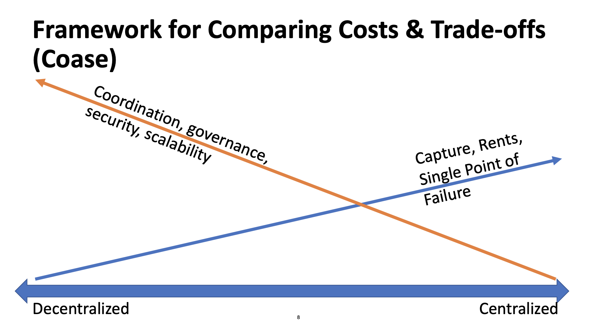

## 스터디 질문
- 확장성, 효율성, 프라이버시, 보안, 호환성과 같은 현재 블록체인 기술의 기술적이고 상업적인 도전들은 얼마나 중요할까요?
- 분산화, 확장성, 보안 사이에서 트레이드오프해야하는 부분은 무엇인가요? 컨센서스 소프트웨어 업데이트, 거버넌스 그리고 '하드 포크'의 트레이드오프는호 무엇인가요?
- 레이어2 어플리케이션, 영지식증명(zero-knowledge proof), 대안적 컨센서스 알고리듬이 현재 상업적인 도전을 해결하기 위해 어떤 역할을 할 수 있을까요?

## 블록체인의 기술적인 특징
- 암호화와 타임스탬프 로그
  - 함호화 해시 함수
  - 시간이 기록되고 추가만 가능한 로그(블록)
  - 블록 헤더와 머클 트리
  - 비대칭 암호화와 전자서명
  - 주소
- 분산화 네트워크 컨센서스
  - 작업증명
  - 고유화폐
  - 네트워크
- 트랜젝션 코드와 장부
  - 트랜젝션 입력과 출력 또는 상태 변화(state transitions)
  - 소비되지 않은 출려값(UTXO) 세트 또는 계정 기반
  - 스크립트, Solidity 또는 기타 프로그래밍 언어

## 분산화의 비용과 트레이드오프를 비교하기 위한 프레임워크
앞으로도 '블록체인'이라는 유행을 따라서 무수히 많은 사업체들이 생겨날 것으로 전 예상합니다. 그런데 꼭 새롭다고 좋은 것은 아니지요. 정말 블록체인이 각 사업에 필요한 것인지 기본적으로 따져봐야할 것들이 있습니다. 수업에서는 경제학자 Coase의 연구를 소개합니다. 분산화에서 중앙화로 갈수록 포획(capture), 초과 이윤(rent)은 높아지지만 단일장애지점(single point of failure)가 생겨나서 비용이 증가합니다. 인터넷이 부분적으로 장애가 나더라도 전세계의 인터넷이 멈추지 않는 것은 인터넷 네트워크가 분산화되어있기 때문이죠. 만약 전 세계의 모든 데이터가 하나의 서버에 모인다고 한다면, 그 서버가 고장났을 때의 피해와 비용은 막심하겠죠? 이게 중앙화된 시스템의 단일장애지점의 예입니다. 반대로, 중앙화에서 분산화로 갈수록 협동, 거버넌스, 보안, 확장성의 비용은 더 커지게 됩니다. 블록체인을 염두에 두고 있는 프로젝트들은 모두 분산화와 중앙화 사이의 어느 지점에서 장단점을 트레이드오프해야할지 결정해야 할 것입니다.

## 블록체인 기술이 해결해야할 과제
- 성능, 확장성과 효율성
- 프라이버시와 보안
- 호환성(interoperability)
- 거버넌스와 단체행동
- 상업적 활용
- 공공정책과 법률체계

## 부테린의 트라일레마(Trilemma)
인생에서 돈, 명예, 시간 중에 두개만 성취할 수 있다는 말이 있죠. 이더리움의 창시자 비탈릭 부테린의 트라일레마는 블록체인에서 **보안, 확장성, 분산화 중에 두개만 골라야한다는 말**입니다. 정말로 둘만 선택해야할지, 세 부분 모두 사용하기 충분할 정도로 발전할지 지켜봐야겠습니다. 

### 처리속도:
- 비트코인: 초당 7-10건
- 이더리움: 초당 20건
- 비자: 초당 20,000건
- DTCC(중앙예탁청산기관): 초당 최대 100,000건

### 작업증명의 에너지 소비
Digiconomist의 추정에 따르면, 비트코인의 에너지 소비량은 2억 kwh/day라고 합니다. 이는 680만 가정의 에너지 소비량 또는 전세계 0.33% 소비량과 비교할 수 있습니다.

## 확장성, 효율성, 프라이버시와 호환성을 해결할 가능성 있는 해결책

### 사이드체인, 샤딩, 레이어2와 지불 채널
모든 거래를 체인 위에서(on-chain) 처리하면 속도와 비용의 부담이 있으므로, 체인 바깥(off-chain)에서 처리한 다음에 그 결과를 블록체인에 저장하는 몇가지 방법들이 나와있습니다. 일반인이 중앙은행과 직접 거래하지 않고 일반은행과 거래하고 그 은행들이 중앙은행과 거래하는 것과 마찬가지입니다. 비트코인의 라이트닝 네트워크(Lightning Network)가 레이어2의 한 예입니다. 

확장성을 해결하기 위해 비트코인(BTC)과 비트코인 캐시(BCH)가 하드포크로 갈라져나온 사례도 있습니다. 그 이유 중 하나는 블록사이즈, 즉 한 블록에 담을 수 있는 거래의 양입니다. 그러나 앞서 트라일레마에서 살펴본 것처럼 이렇게 확장성을 높이면 분산화와 보안에 영향을 줄 수 있습니다. 한 블록에 담을 수 있는 거래량이 커지면 더 많은 데이터를 처리할 수 있는 장비를 갖춘 마이너들만 운영이 가능하기에 네트워크 전체적으로 마이너들이 줄어들 수 있습니다. 겐슬러 교수는 이 외에도 마이너들의 경제, 정치가 한 역할을 한다고 봅니다. 블록의 양에 따라 마이너들의 리워드가 달라지기 때문이겠죠.

### 기타 컨센서스 프로토콜
보통 기타 프로토콜들은 블록을 검증하기 위한 노드를 선택할 때 무작위로 뽑거나 위임하는 방식을 사용합니다. 블록 검증작업을 확인하는 추가적인 메카니즘이 있는 경우도 있습니다. 구체적인 방법들은 [4강](mit-blockchain-course-4)에서 알아보았습니다.

### 프라이버시와 보안
- 가명주소(pseudonymouse addresses)의 모순된 갈등관계
  - 법 집행기관과 규제관들은 더 높은 투명성을 원합니다.
  - 금융기관, 규제관과 일부 사용자들은 더 낮은 투명성을 원합니다.
- 불법행위를 조장하는 프라이버시 코인과 메커니즘에 대한 우려
  - 코인: Dash, Monero, Zcash
  - 메커니즘: Mixers 또는 Tumblers
  - 수업에는 Zcash의 개발자 중 한사람인 Madars Virza가 앉아있었는데, Zcash를 개발한 이유를 묻자, 프라이버시는 인간의 권리이며, 불법행위는 현금이나 다른 수단으로도 이루어지고 있어서 암호화폐만의 문제는 아니라고 답변했으며, 커피 한잔을 살 때도 내 모든 거래내역을 밝힐 필요는 없기 때문이라는 답변을 했습니다. 비트코인의 지갑주소가 암호화되어있는 것은 사실이나, 그 주소를 검색하면 모든 거래내역이 공개되어있으니 익명성의 보장이라기보다는 가명을 사용할 수 있게 해준다고 봐야겠지요.
- 개인키의 관리, 생성과 보관의 사이버보안 문제
  - 해킹, 잘못된 관리나 절도로 인한 큰 손실
- 가능성 있는 해결책들은 1.영지식증명(zero knowledge proofs), 2.페더슨 커밋먼트(Pedersen Commitments)를 사용합니다.
  - 어떤 명제가 구체적으로 왜 참인지 밝히지 않고도 그 명제가 참임을 증명할 수 있도록 하는 암호화 프리머티브(primitives) 그리고
  - 페더슨 커밋먼트는 또다른 프리머티브로 해시처럼 많은 데이터를 압축할 수 있으면서 그 데이터에 더하거나 빼기가 가능합니다. 

### 호환성
- 블록체인 애플리케이션을 기존 데이터베이스, 인프라와 기술과 연결하는 것을 말합니다. 각 블록체인과의 연결도 포함합니다. 각 국가 간 다른 시스템의 은행끼리 다른 화폐 단위를 주고받을 수 있는 것도 호환성에 해당합니다. 
- 블록체인 안으로, 또는 블록체인 사이에서 자산과 정보를 옮기는 일을 조정할 때 'cost of trust'가 증가합니다.
- 한가지 해결책은 사이드체인이나 레이어0과 같은 분산화 메커니즘을 사용해서 체인들 사이에서 데이터를 옮기는 방법이 있습니다.
- 블록체인 사이에서, 그리고 기존 기술과의 연결에서 매끄러운 움직임이 가능하기 위해서는 아직 해결해야할 과제들이 많습니다.

## 가장 큰 과제인 거버넌스

### 소프트웨어를 업데하기 위해 필요한 컨센서스
- 구버전과 호환이 되지 않는 오픈소스 소프트웨어 업데이트
  - 이전 버전의 소프트웨어는 새로 생성되는 블록을 검증할 수 없습니다.
- '하드 포크'가 일어날 수 있습니다.

### 단체행동
- 블록체인은 수많은 당사자들이 네트워크에 참여함으로써 가치를 만들어냅니다. 도입(adoption)과 대중화를 위해서는 집단적인 행동이 필요합니다.
- 닭이 먼저냐, 달걀이 먼저냐의 딜레마: 얼리아답터들이 네트워크 효과를 가져다주지만, 점진적인 도입으로 가는 길은 명확하지 않습니다.
- 현재로써는 금융기관들은 permissioned 블록체인을 선호하고 있습니다.

---
현재 바이든 정부의 SEC 의장 개리 겐슬러 교수가 MIT에서 2018년에 블록체인과 화폐를 주제로 수업한 내용을 정리하고 있습니다. 이 요약노트는 무엇보다도 제 스스로의 공부를 위한 글입니다. 강의 내용 이외에도 제 생각들을 덧붙였기 때문에 강의 자체에 관심이 있는 분들은 원본 강의 영상을 보시길 권합니다. [강의 웹사이트](https://ocw.mit.edu/courses/sloan-school-of-management/15-s12-blockchain-and-money-fall-2018/video-lectures/)에도 영상, 리딩 등이 잘 정리되어있습니다. 강의는 [CC BY-NC-SA 라이센스](https://creativecommons.org/licenses/by-nc-sa/4.0/)로 공개되어 있습니다.

<iframe width="560" height="315" src="https://www.youtube.com/embed/GLVrOlHLJ1U" title="YouTube video player" frameborder="0" allow="accelerometer; autoplay; clipboard-write; encrypted-media; gyroscope; picture-in-picture" allowfullscreen></iframe>