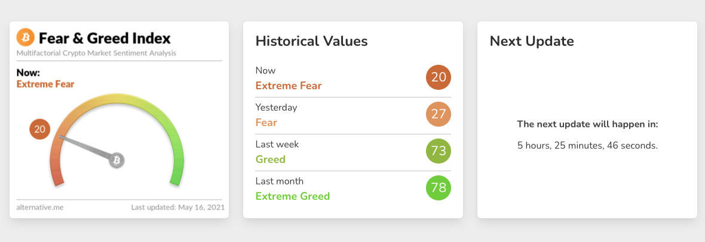
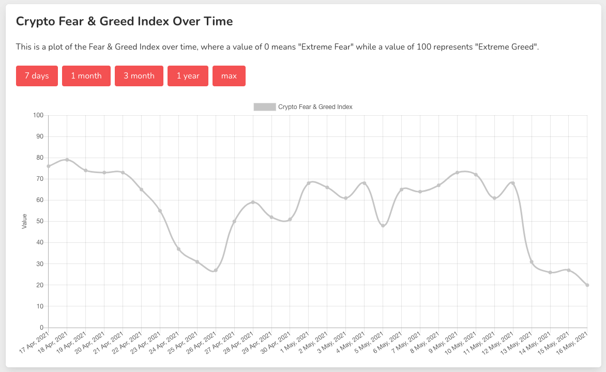
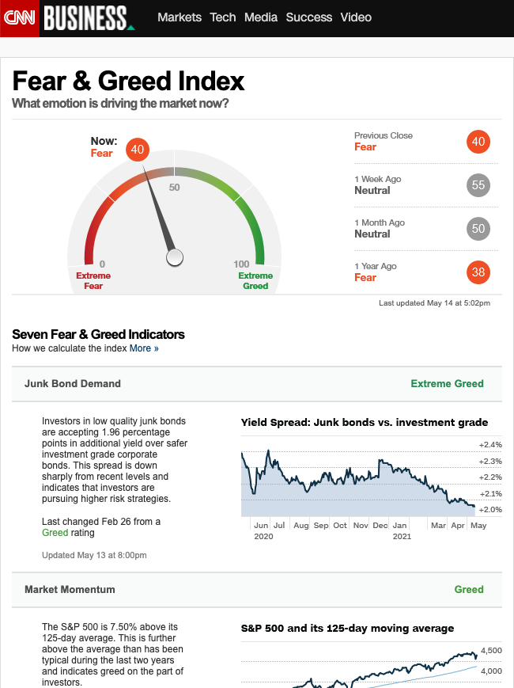

위 이미지는 현재 실시간으로 업데이트되는 [두려움과 욕심의 지표(Fear & Greed Index)](https://alternative.me/crypto/fear-and-greed-index/)입니다. 투자를 할 때에는 단기적인 그래프의 움직임에 대한 분석 뿐만이 아니라 장기적인 경제, 사회적인 상황에 대한 이해와 분석도 중요하지요. 다양한 현상을 수치로 표현해주는 그래프들이 큰 도움을 줍니다. 위에 소개해드린 그래프는 비트코인을 기준으로 코인 투자자들의 감정상태를 표로 측정해 나타내는 자료입니다. 화살표가 Fear 쪽으로 기울어 있으면 투자에 대해 걱정하는 사람들이 많다는 뜻이고 Greed 쪽으로 기울어있으면 과열현상이 있다는 뜻이지요. 비트코인 데이터만으로 나타난 지표긴 하지만 대부분의 알트 코인들이 비트코인과 그래프를 공유하는 특성이 있는 코인 시장에서는 참고할만한 자료입니다.

글을 읽으시는 지금, 지표는 어디를 가리키고 있나요? 제가 글을 작성하는 2021년 5월 16일의 모습은 **20을 가리키면서 극심한 두려움의 상태**라고 합니다. 이번 주말에 코인들 대부분의 가격이 하락했습니다. 이전 하락장이었던 4월 24일-27일에도 두려움이 높게 나왔는데, 오늘은 그보다 더 심하네요. 투자한 코인에 대한 장기적인 믿음이 있다면 다른사람들이 모두 두려워하고 있는 시점이 오히려 기회가 될수도 있겠죠?

웹사이트에서는 지표를 만들기 위한 데이터가 어디에서 오는지 설명하고 있습니다. 일단, 불안정성(volatility)이 25%, 시장의 모멘텀과 볼륨이 25%, 소셜미디어(현재는 트위터로 측정, 레딧도 추가할 예정이라네요)가 15%, 설문조사(현재는 중단된 상태)가 15%, 비트코인의 점유율(dominance)이 10%, 추세(trends)가 10%로 계산된다고 합니다.

코인 관련은 아니지만 CNN 비즈니스 코너에서도 [전반적인 시장의 두려움과 욕심의 지표](https://money.cnn.com/data/fear-and-greed/)를 제공하고 있으니 여기도 참고해보세요.

