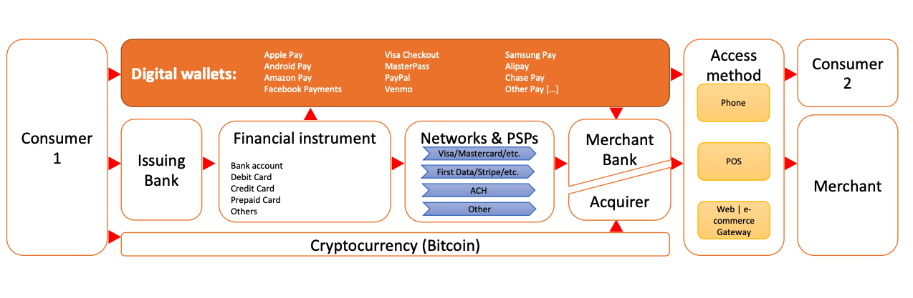

<iframe width="560" height="315" src="https://www.youtube.com/embed/ojcOUtUwIe4" title="YouTube video player" frameborder="0" allow="accelerometer; autoplay; clipboard-write; encrypted-media; gyroscope; picture-in-picture" allowfullscreen></iframe>

---

## 스터디 질문
- 모바일앱, 전자지갑, 오픈뱅킹, 향상된 은행이체와 인증 등 오늘날 지불 시스템(payment systems)의 주된 경향은 무엇인가요? 
- 알리페이, 위챗페이, 엠-페사, 인도의 IMPS와 미국의 모바일지불 앱 등과 같은 비 블록체인 지불의 혁신에서 배울 수 있는 점은 무엇인가요?
- 현재의 국가간 지불시스템 설계에는 어떤 과제와 기회가 있나요?

## 지불 시스템, 장부와 신용카드
지불 시스템(payment system)은 장부에 돈의 흐름을 수정하고 기록하는 방법을 말합니다. 승인(authorization)은 거래 당사자와 은행의 허락을 받는 과정이며, 청산(clearing)은 복수의 거래내역을 합쳐서 순(net) 가격을 내는 과정이며, 최종 결제(final settlement)의 기록으로 거래가 완결됩니다.

장부는 경제 활동과 재정적인 관계를 기록하고, 거래와 계정(account)을 기록합니다. 비트코인은 거래를 기록하는 장부이고, 이더리움은 계정 잔고를 기록하는 장부입니다.

신용카드는 1887년 공상과학소설에서 미래를 묘사할 때 처음 등장했고, 1880-1960년대에 특정상인을 상대로 사용할 수 있는 충전식 금속판과 코인이, 1920년대에는 자동차 기름을 넣을 수 있는 신용토큰이 등장했습니다. 1946년 뉴욕 브루클린에서 처음으로 일반적 사용이 가능한 신용카드가 출시되었습니다.

### 현대 지불시스템
현재 우리가 물건을 사거나 돈을 주고 받을 때에는 아래 사진과 같이 수많은 레이어를 거쳐서 거래가 이루어집니다. 여기에 암호화폐가 들어온다면 중간의 과정들을 모두 건너뛰게 될까요? 소비자나 은행, 상인들은 현재의 시스템을 어느정도 만족하며 사용하고 있습니다. 암호화폐가 이런 과정을 바꾸려고 한다면 어느부분에 기회가 있을까요? 지불시스템에 드는 비용은 전세계 GDP의 0.5~1%라고 하니 굉장히 큰 사업영역입니다.

### 거래의 세부 내역
미국에서 일반적으로 신용카드를 사용해서 $100의 상품을 구매한다면, $97.25는 상인에게, $2.20은 발행은행, $0.23은 지불업체, $0.19는 매수은행, $0.13는 카드 네트워크로 돌아갑니다. 약 2.75%가 지불시스템에 들어가는 비용인 셈입니다. 중국의 경우는 미국과 다르게 은행이나 신용카드 시스템이 개발되어있지 않았기 때문에 (다른 관점에서는 예전의 시스템에 의존할 필요가 없었기 때문에) 위챗페이, 알리페이 등이 출현하고 발전할 수 있었습니다.

국가 간의 거래는 더 복잡합니다. 작은 지역은행을 통해 국가간 송금을 한다면 그 중간에 다리 역할(correspondent bank)을 하는 국제은행을 통해야하는 신뢰의 비용이 발생합니다. 이런 다리 역할을 암호화폐가 할 수 있을까요? Ripple의 XRP가 브리지화폐(bridge currency)의 한 예입니다. XRP는 현재 은행권에서 사용하는 SWIFT를 대체하는 지불 메시징 서비스를 제공합니다. 암호화폐는 아직까지 가격이 불안정합니다. 송금할 때 가격이 불안정하면 사용성이 떨어지겠지요. 이 문제를 해결하기 위해서 XRP는 굉장히 빠른 초 단위의 거래 처리속도를 내세우고 있습니다. 또는 스테이블코인(stable coin)도 대안이 될 수 있습니다. 현재 국제송금 서비스를 하는 웨스턴유니온같은 경우는 수수료가 무려 10%까지 되기도 합니다.

## 지불과 관련한 기술
- 블록체인: 기존의 암호화폐들이 실패했던 더블스팬딩 문제를 해결했습니다.
- Open API
- 생체인식기술
- 모바일
- RPA

## 디지털, 모바일 지불
- 페이팔, 1998
- 에릭슨, Telenor, 1999
- 알리페이, 2003
- 엠-페사, 사파리콤, 2007
- 스타벅스 모바일앱, 2011
- 구글 월렛, 2011
- 위챗페이, 2013
- 애플페이, 2014

## 미국과 전세계 지불 통계
소비자와 비즈니스, 은행 간의 간격(gap)을 메우는 다양한 시스템들이 생겼습니다. 케냐에서는 은행계좌는 없으나 셀폰 사용이 가능한 인구를 대상으로 남는 모바일 통화시간을 거래할 수 있는 M-Pesa 서비스가 나왔고, 중국에서는 채팅 서비스로 시작해서 지불 레이어를 더한 위챗페이가 나왔습니다. 스타벅스 모바일앱은 돈을 충전해서 쓰는 카드형식이지만, 이제는 가치의 저장 수단이 될 정도로 규모가 커지기도 했습니다. 다른 서비스들은 유저인터페이스의 간격을 메우기도 합니다. 중국과 인도에서는 QR코드를 많이 사용하고 있습니다. 미국은 더 이상 지불시스템에서 앞서나가는 모습이 아닙니다. 어떤 의미에서는 수십년 전에 만들어진 신용카드 기반의 오래된 시스템이 혁신의 걸림돌이 된다고 볼 수도 있고, 중국, 인도와 같은 국가에서는 그런 인프라가 없기 때문에 더 새로운 기술들을 빠르게 받아들인다고 볼 수도 있겠습니다.

## 비트코인과 블록체인 기술
비트코인과 블록체인 기술은 경제와 어떤 영향을 주고받을지, 블록체인의 이점과 구체적인 활용사례들은 무엇인지, 기술적인 과제와 전환 과정의 비용은 무엇인지, 순이익은 블록체인으로 옮겨갈만큼 충분한지 물어볼 필요가 있습니다. 이런 질문에 대한 답이 긍정적이지 않다면, 기존의 전통적인 데이터베이스를 사용하는 것이 더 나을수 있습니다.

---
현재 바이든 정부의 SEC 의장 개리 겐슬러 교수가 MIT에서 2018년에 블록체인과 화폐를 주제로 수업한 내용을 정리하고 있습니다. 이 요약노트는 무엇보다도 제 스스로의 공부를 위한 글입니다. **저의 부족한 지식으로 인해 사실과 다른 내용이 있을 수도 있고, 강의 내용 이외에도 제 생각들을 덧붙였기 때문에 강의 자체에 관심이 있는 분들은 원본 강의 영상을 보시길 권합니다.** [강의 웹사이트](https://ocw.mit.edu/courses/sloan-school-of-management/15-s12-blockchain-and-money-fall-2018/video-lectures/)에도 영상, 리딩 등이 잘 정리되어있습니다. 강의는 [CC BY-NC-SA 라이센스](https://creativecommons.org/licenses/by-nc-sa/4.0/)로 공개되어 있습니다.