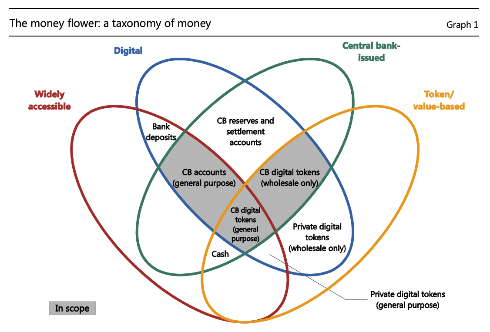

## 스터디 질문
- 중앙은행이 중앙은행디지털화폐(CBDC)를 통해 디지털리저브(digital reserve)에 대한 접근을 넓히려고 할 때 어떤 전략적인 고려가 필요할까요?
- 소매 대 도매의 접근성은 어떠할지, 토큰방식일지 계좌방식일지, 이자를 줄지, 서비스레벨은 어떠할지와 같은 디자인 고려사항들은 중앙은행의 결정에 어떤 비중을 차지할까요?
- CBDC는 상업은행의 모델, 통화정책이행, 지불시스템의 회복력과 재정안정 등에 어떤 과제를 안겨주게 될까요?

## 법정화폐와 중앙은행
법정화폐는 중앙은행에서 발행하는 화폐로 세금과 빚의 지불이 가능합니다. 공공과 민간영역 모두에서 사용가능해서 큰 네트워크효과를 지니고 있습니다. 계산의 단위, 교환의 수단으로 사용됩니다. 

### 법정화폐
- 중앙은행 발행권과 상업은행의 예금으로 대표됩니다.
- 장부 시스템에 의존합니다.
- 세금 납부용으로 사용가능합니다.
- 공공과 민간영역 모두에서 빚의 지불에 사용가능합니다.

### 중앙은행과 상업은행 장부
중앙은행과 상업은행 장부는 위계구조를 보여줍니다. 가장 상위의 중앙은행은 **예비금(reserves)**과 **현금(cash)**를 가지고 있고, 아래의 상업은행들은 **예금(bank deposits)**을 가지고 있습니다. 예비금은 중앙은행이 상업은행에게 발행한 예금입니다. 일반인들은 상업은행에 예금을 가지고 있습니다. 또한 우리가 소유한 현금은 중앙은행이 발행한 것으로 중앙은행에서 그 가치를 저장하고 있습니다. 상점에서 카드를 긁는다면, 고객의 상업은행과 상인의 상업은행 사이에서 예금이 오가는 것입니다. 각 은행의 **계정**은 다른 말로 **장부**라고 표현할 수 있습니다. 결국, 은행시스템은 장부를 업데이트하는 시스템이군요. 각 상업은행 간의 거래, 상업은행과 중앙은행의 거래는 즉시총액결제(real-time gross settlement) 시스템을 사용합니다. 미국에서는 Fedwire와 Chips를 사용합니다. 은행에서 일하지 않는 이상, 이렇게 상세하게 알 필요는 없겠지만, 블록체인이 은행권의 업무를 대체하려고 한다면 어떤 부분을 대체할 수 있는지 알아볼 필요는 있겠습니다.

각 국가의 GDP에서 현금이 차지하는 비중을 보면, 스웨덴은 2% 정도로 하락 추세에 있고, 미국의 경우는 8% ($1.6 Trillion)정도로 상승하고 있습니다. 대부분의 국가에서 현금 비중은 상승하고 있습니다. 서브프라임 위기 이후에 상업은행의 예금을 믿지 못하는 사람들이 중앙은행이 발행하는 현금 비중을 높였다는 분석이 있습니다. 시중에 유통 중인 미국 달러의 대부분은 100달러 지폐입니다. 

### 중앙은행의 목표와 기능
- 경제정책의 목표: 미국 연방준비은행의 'Dual Mandate'는 **'최대 고용, 안정적인 가격과 장기이율을 적절히 조절하는 목표를 효과적으로 촉진한다'**고 설명합니다.
- 법정화폐의 관리
  - 공급: 물리적인 현금과 본원통화(monetary base)의 공급을 조절합니다. M1은 현금과 요구불예금(demand deposit)으로 $3.5-4 Trillion, M2는 나머지 예금을 포합하며 $14 Trillion 규모입니다. M3와 기타종류도 있습니다. 중앙은행은 예비금과 자본(capital)도 관리합니다.
  - 가격: 
    - Interest rate Open Market Operations
    - Foreign Exchange Interventions
    - Exchange Controls
- 부분지급준비(fractional banking)시스템 감독
  - 예비금(reserves)을 제공합니다.
  - 금융시스템을 규제하고 감독합니다.
  - 안전하고 효율적인 지불시스템을 촉진합니다.
  - 은행이 실패했을 때 최후의 수단으로 대출을 해줍니다.
- 정부를 대상으로 하는 은행
  - Foreign Exchange Reserves 관리
  - Government Bond Auctions 수행
  - Lender of last resort

## 블록체인 기술을 대하는 중앙은행의 접근방식
- 상황을 살피면서 연구하고 있습니다.
- 사용을 제한하고 있습니다.
- 지불시스템을 가지고 실험하고 있습니다. 
- CBDC 사업을 추진하고 있습니다. 중앙화폐 사업은 꼭 블록체인 기술을 사용할 필요는 없습니다.

## 지불시스템과 블록체인 사업

### 공공섹터의 일반적인 지불 이니셔티브
암호화폐의 출현에 영향을 받았지만, 블록체인을 사용하지 않는 사업들의 예입니다.

- 유럽연합: Target Instant Payment Settlement(TIPS) & Payment System Directive II
- 인도: Immediate Payment Service
- 영국: 즉시총액결제(Real-time Gross Settlement)시스템의 업데이트와 오픈뱅킹
- 미국: Faster Payment Task Force

### 중앙은행 블록체인
- 1단계 (2016): 캐나다, 브라질, 싱가포르는 이더리움 네트워크를 기반으로 더 나은 지불시스템을 만들 수 있을지 실험했습니다.
- 2단계 (2016-2018): 캐나다, 브라질, 싱가포르, 일본, 남아공의 중앙은행들이 실험하였는데, 이더리움 대신에 허가형 블록체인을 사용했습니다.
- 3단계: 현재 일본, 유럽, 캐나다, 싱가포르 등에서 3단계 실험 중입니다.

### 싱가포르의 Ubin 프로젝트
싱가포르의 블록체인 프로젝트 Ubin에 관한 리포트가 나와있습니다. 2단계에서 Corda, Hyperledger Fabric, Quorum 등의 허가형 블록체인을 실험했고, 6가지의 기준--지불의 디지털화, 분산화처리, 지불대기열 처리, 거래 프라이버시, 결제완결성, 유동성 최적화--으로 평가했습니다. 블록체인의 사용을 통해서 중앙은행은 단일장애지점(single point of failure)을 해소하려고 하는데, 얼마나 어떻게 스스로의 힘을 제한할지가 중요한 부분입니다.

## 중앙은행디지털화폐(CBDC)와 '머니플라워'
중앙은행은 현재 상업은행을 대상으로 디지털 예비금(digital reserves)을 발행하고 있습니다. 대중을 대상으로는 물리적인 토큰(현금과 코인)을 발행하고 있습니다. 상업은행은 대중에게 디지털화폐(예금)을 제공합니다. 본질적으로 이는 CBDC를 상업은행이 중간매개한 형태입니다. 민간부문에서는 안정가치토큰(stable value tokens)으로 실험하고 있습니다. 현금이 중앙은행과 소유자의 직접적인 관계를 나타내는 것처럼 **디지털 예비금의 직접적인 접근을 넓혀야하는가**가 중앙은행의 전략적인 질문입니다.

### CBDC의 기회
- 정부의 지급수단(means of payment) 공급을 지속합니다.
- 은행시스템의 경쟁을 촉진합니다.
- 재정포용(financial inclusion)을 촉진합니다.
- 지불시스템의 불만지점(pain points)을 해소합니다.
- 국가에 따라서는 금융제재를 피할 수 있습니다. (베네수엘라, 이란 등)

### CBDC와 블록체인
- 법정화폐는 장부에 기록됩니다. 중앙은행과 상업은행의 장부가 있고, 비은행권의 장부가 있습니다.
- 돈의 경제에 검증(verification)과 네트워킹은 아주 중요합니다.
- 두가지 모두 블록체인이 향상시킬 수 있는 부분들입니다.

### CBDC의 과제와 불확실성
- 재정안정의 어려움과 예금인출쇄도(bank runs)의 완화를 증가시킬 가능성
- 상업은행의 예금과 펀딩 모델의 변화
- 신용할당과 경제에 미칠 영향
- 통화정책 실행과 전달
- 개방형 지불 인프라의 회복력(resilience)

### CBDC 디자인 고려사항
- 넓고 쉬운 접근 vs. 도매
- 토큰(e-money) 또는 계정(e-deposit)기반
- 발행인: 중앙은행, 상업은행, 기타단체
- 익명성의 정도
- 이체 메커니즘
- 제한, 한도
- 이자(interest bearing)와 계정서비스의 정도

### 머니 플라워
머니플라워 도표의 네가지 기준--windely accessible, digital, central bank issued, token-based--을 통해서 다른 종류의 화폐들을 쉽게 분류해볼 수 있습니다.

### 공공부문 디지털화폐 사업
- 두바이: emCash project
- 에콰도르: Dinero Electrónico. 미국달러를 사용한 전자화폐입니다.
- 이란: 이란의 Rials에 기반한 Indigenous Cryptocurrency
- 세네갈: eCFA
- 스웨덴: E-Krona 사업
- 튀니지아: e-Dinar
- 영국: Royal Mint GOld
- 우루과이: 디지털 우루과이 페소의 6개월 파일럿사업
- 베네수엘라: Petro Oil에 기반한 ICO

---
현재 바이든 정부의 SEC 의장 개리 겐슬러 교수가 MIT에서 2018년에 블록체인과 화폐를 주제로 수업한 내용을 정리하고 있습니다. 이 요약노트는 무엇보다도 제 스스로의 공부를 위한 글입니다. **저의 부족한 지식으로 인해 사실과 다른 내용이 있을 수도 있고, 강의 내용 이외에도 제 생각들을 덧붙였기 때문에 강의 자체에 관심이 있는 분들은 원본 강의 영상을 보시길 권합니다.** [강의 웹사이트](https://ocw.mit.edu/courses/sloan-school-of-management/15-s12-blockchain-and-money-fall-2018/video-lectures/)에도 영상, 리딩 등이 잘 정리되어있습니다. 강의는 [CC BY-NC-SA 라이센스](https://creativecommons.org/licenses/by-nc-sa/4.0/)로 공개되어 있습니다.

<iframe width="560" height="315" src="https://www.youtube.com/embed/lPD9fx8fK1k" title="YouTube video player" frameborder="0" allow="accelerometer; autoplay; clipboard-write; encrypted-media; gyroscope; picture-in-picture" allowfullscreen></iframe>