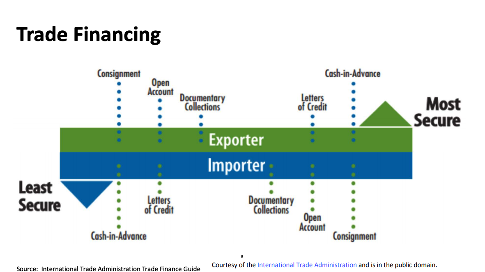

1강부터 읽으실 분들은 다음 링크에서 시작하세요: [1강 바로가기](https://coinmoon.xyz/mit-blockchain-course-1/)

현재 바이든 정부의 SEC 의장 Gary Gensler 교수가 MIT에서 2018년에 블록체인과 화폐를 주제로 수업한 내용을 정리하고 있습니다. 이 요약노트는 무엇보다도 제 스스로의 공부를 위한 글입니다. **강의 내용 이외에도 제 생각들을 덧붙였기 때문에 강의 자체에 관심이 있는 분들은 아래 원본 강의 영상을 보시길 권합니다.** [강의 웹사이트](https://ocw.mit.edu/courses/sloan-school-of-management/15-s12-blockchain-and-money-fall-2018/video-lectures/)에도 영상, 리딩 등이 잘 정리되어있습니다. 강의는 [CC BY-NC-SA 라이센스](https://creativecommons.org/licenses/by-nc-sa/4.0/)로 공개되어 있습니다.

<iframe width="560" height="315" src="https://www.youtube.com/embed/DsSzQfejwMk" title="YouTube video player" frameborder="0" allow="accelerometer; autoplay; clipboard-write; encrypted-media; gyroscope; picture-in-picture" allowfullscreen></iframe>

---

## 스터디 질문
- 무역금융과 공급망 관리의 어떤 특성들이 블록체인 적용의 가능성을 높게 만들어주나요?
- 현재 진행 중인 프로젝트에서 배울 수 있는 점은 무엇일까요?

## 무역금융
전세계 화물 수출 규모는 17조 달러이고, 이 중 제조업은 12조입니다. 무역업의 중소기업들은 신용의 확신이 없는 관계로 은행에서 대출을 거절당하는 경우가 많습니다.

- 은행을 통하는 전통적인 '무역 금융'
  - 신용장(letter of credit)을 통해 바이어의 상대측 위험(counterparty risk)을 없애서 지불을 보장합니다. 
  - 화환추심(documentary collection)은 은행이 전세계에 걸쳐서 서류 작업을 해주는 서비스를 말합니다.
  - Factoring(selling short-term receivables) and Forfaiting(long-term)
  - Import and Export Loans
  - Pre-Export Finance
  - Supplier Credit
  - Supply Chain Finance
- 상업적인 계약 '무억 신용(trade credit)'
  - Open Account: 지불을 받기 전에 상품을 보내는 것을 말합니다.
  - Cash in Advance
  - Consignment: 국제무역에서는 많이 쓰이지 않습니다.
- 수출신용보험(Export Credit Insurance)과 Public Guarantees

위의 도표에서 볼 수 있듯이, 수입업자와 수출업자에게 가장 안전한 방식은 상반됩니다. 대부분의 무역은 가운데 지점에서 이루어집니다.

### 계약
수출업자가 수입업자와 계약을 할 때, 수입업자는 담당은행에 신용장을 신청합니다. 신용장은 수출업자의 담당은행에 전달이 되고, 수출업자의 은행은 수출업자에게 신용장을 인증해줍니다. 상대측 위험을 없애기 위해서 이렇게 다양한 단계를 걸쳐서 계약이 이루어집니다.

### 실행
수출업자는 물건을 발송하고 담당은행에 서류를 제출합니다. 수출업자의 은행은 수입업자의 은행에 서류를 보냅니다. 수입업자의 은행은 수출업자의 은행에 대금을 지불하고, 이 금액은 수출업자에게 전달됩니다. 수입업자는 담당은행에 대금을 지불하고 은행은 수입업자에게 서류를 양도합니다. 지불의 시점이나 기타 사항들은 제각각 다릅니다.

신용장 사용의 비중은 갈수록 줄어들고 있고, Open Account 방식은 늘어나고 있습니다. 특히 대규모 무역기업들은 은행을 통하기보다는 신용을 사용하는 방식을 선호하고 있습니다.

## 무역금융과 블록체인 기술
무역금융에는 거래에 연관된 당사자들이 많고, 이에 필요한 서류들은 훨씬 더 많습니다. 따라서, 서류를 위조하는 경우도 많이 생깁니다. 검증(verification)이 매우 중요한 사업분야입니다. 이런 위험과 비효울적인 과정을 줄이기 위해서 블록체인이나 유사한 기술이 도움이 될 것이라고 말합니다. 

## 운송과 공급망 관련 블록체인 프로젝트

### 무역금융 블록체인 컨소시엄
- Voltron - Corda: 신용장
- Marco Polo - Corda: Receivable and Payment Guarantee Financing
- Batavia - IBM: Monitor Open Transactions
- We.Trade - IBM: 신용장
- HKTFP - Ping An Group: 공급망 서류보관

### 무역금융 기타 프로젝트
- 중국: Peoples Bank of China는 무역금융 블록체인 플랫폼을 후원하고 있습니다.
- 두바이: TradeAssets 마켓플레이스에서 무역금융 자산을 거래할 수 있습니다.
- 홍콩과 싱가포르: Global Trade Connectivity Network for Documents
- 인도:
  - Finacle Trade Connect for validation, documents and payment
  - Trade Receivables e-Discounting linked to RBI Trade Receivable e-Discounting system
- Komgo SA: 이더리움 기반 고유화폐. ConsenSys + 15 banks and trading firms

### 운송과 공급망 블록체인 프로젝트
효율성에 대한 한가지 예로, 만약 하나의 식재료에서 대장균이 발견되었다고 한다면 기존의 수많은 서류가 오가는 시스템에서는 원인이 되는 공급업자를 찾아서 조치를 취할 때까지 많은 시간이 걸리게 되고, 그때까지는 모든 공급자들의 사업이 중단될 수도 있습니다. 블록체인을 통해 공급망을 운영하고 있었다면 훨씬 빠르게 원인을 찾아낼 수 있을 것입니다. 물론, 현실의 물건이 디지털로 옮겨지는 과정에서 신뢰가 필요하기는 합니다. 현실적으로 블록체인을 도입하는 데에는 다른 어려움도 있습니다. 이해관계가 다른 각각의 업체들이 호환성을 유지하기 어려울 수 있습니다. 시장에서 파워를 가지고 있는 업체가 블록체인 공급망을 먼저 시작한다면, 다른 업체들에서는 데이터를 공유하면서 생길 수 있는 손실에 대한 우려를 할 수 있습니다. 

- 운송: Accenture, TradeLens(IBM and Maersk)
- 공급망: Carrefour(닭, 유제품, 기타 식품), DeBeers(다이아몬드), TrustChain(IBM, 보석), Walmart(IBM, 농장에서 제품선반까지), World Bank(팜오일)

## 블록체인의 사용성 평가하기
- 어떻게 **가치**를 만들어낼 계획이며 어떤 불만사항을 해결하려고 하나요?
- 어떤 **거래들과 데이터의 기록**이 필요한가요?
- 어떤 **다수의 이해당사자**들이 장부를 **기록**하고 열람할 필요가 있나요?
- **검증**과 **네트워킹**의 어떤 비용을 절약할 수 있나요?
- 비슷한 가치나 시장에 접근하기 위해 **경쟁자**들은 무엇을 하고 있나요?
- 왜 **추가만 가능한 로그**와 **다수의 당사자들의 컨센서스**가 가장 좋은 솔루션인가요?
- 개방형 블록체인의 경우, 왜 **고유화폐**를 사용하는 것이 최선인가요?
- 왜 개방형을 사용해야하나요?
- 어떤 **트레이드오프**가 필요한가요? 확장성, 성능, 프라이버시, 보안, 호환성과 조정(coordination)
- 허가형 블록체인이나 **전통적인 데이터베이스**로도 충분히 해결가능한가요?
- 어떻게 **대중화**를 이룰 수 있을까요?
- **고객 인터페이스**는 무엇이며, 어떤 부분에서 현재 인터페이스보다 나은가요?

## 정리
무역금융은 17조 달러가 되는 큰 규모의 시장입니다. 다양한 이해당사자가 엮여있고 서류작업의 비중이 큽니다. 검증, 네트워킹과 신뢰가 무역금융경제의 핵심입니다. 현재 다수의 컨소시엄과 프로젝트가 진행 중입니다. 은행, 정부와 운송업자들은 대부분 허가형 블록체인을 탐구하고 있습니다. 블록체인 기술이 무역금융에 변화를 가져올 촉매제 역할을 할 것으로 예상됩니다.