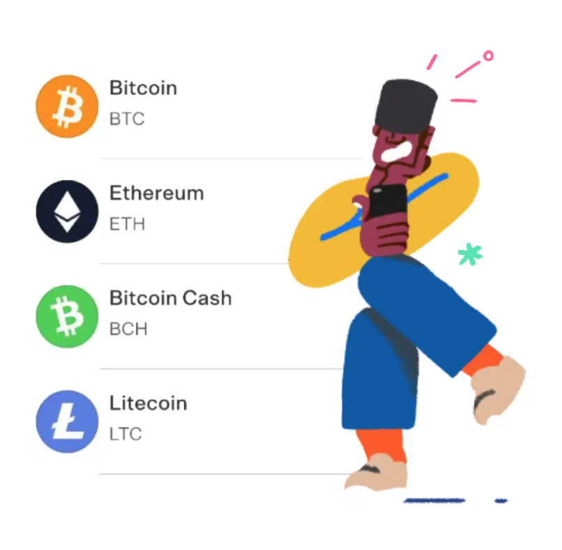

미국의 가장 큰 온라인 결제 시스템 중 하나인 Paypal에서 암호화폐거래를 시작한데에 이어 페이팔이 소유하고 있는 Peer-to-peer 돈거래 앱 Venmo에서도 이제 암호화폐의 구매/판매/보유가 가능해졌습니다. 

Venmo의 모회사가 Paypal인지라 크게 놀랄만한 사실은 아니지만 그래도 젊은 세대들에게 훨씬 접근성이 높은 앱인 Venmo에서 1불 단위부터 암호화폐 거래가 가능해진다는 것은 암화화폐시장에 좋은 소식이 아닐수 없습니다. 일단은 모든 암호화폐가 아닌 딱 4가지 종류만 거래가 가능합니다. 종류가 적은만큼 여기 속한 코인들의 인기를 가늠해볼 수 있겠네요.

이렇게 비트코인, 이더리움, 비트코인캐쉬와 라이트코인이 먼저 제공되는 4가지 암호화폐들입니다. 

페이팔에서 거래가능한 리스트와 100% 동일하네요. 안타까운 것은 P2P 시스템인 벤모에서 아직은 암호화폐를 주고받는 것은 불가능하다는 것입니다. 현재는 사거나 팔거나 보관하는 것만 가능하다고 합니다. 페이팔에서 곧 암호화폐를 다른 지갑이나 거래소로 이동할수 있도록 하겠다고 했으니 그쯤에 벤모 역시도 같은 소식이 들리지 않을까 합니다. 아무래도 암호화폐는 전문 거래소(코인베이스나 제미나이 등)에서 거래하는 것이 가장 수수료가 저렴하긴 하지만 새로 거래소 계정을 만드는 번거로움 없이 기존에 이용 중이던 페이팔이나 벤모 계정에서 쉽게 암호화폐를 거래할수 있다는 것은 큰 장점이고 암호화폐의 수요층을 늘릴 수 있을 것이라고 봅니다. 지금 전고점대비 많은 하락세를 보이고 있는 암호화폐들에게 좋은 소식이 될 수 있을까요?

