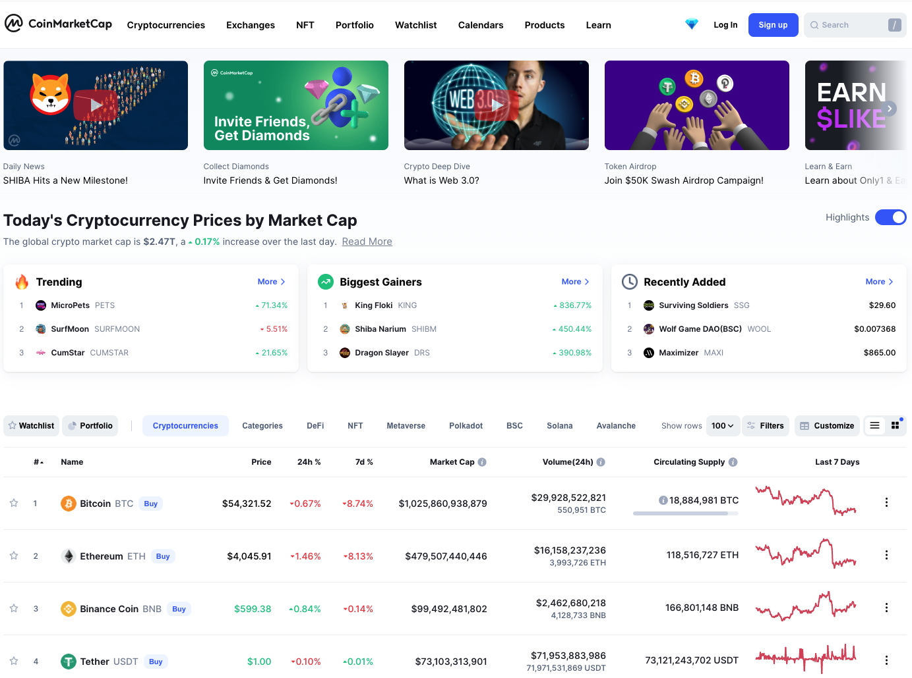
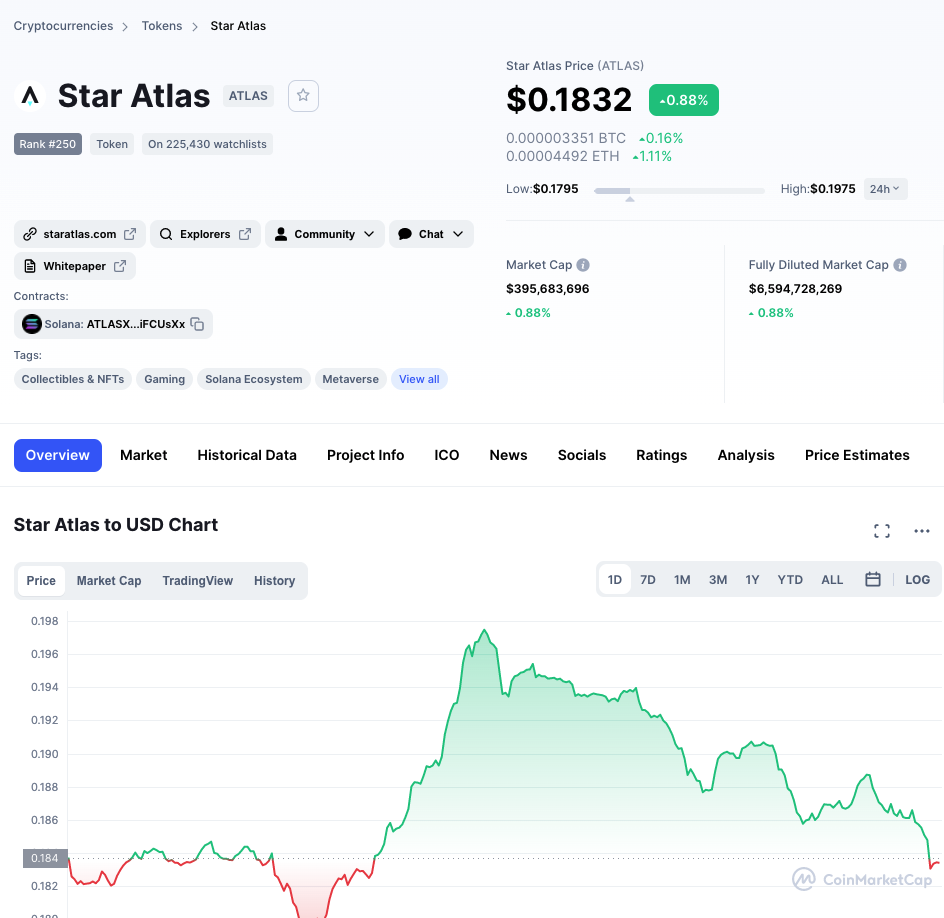
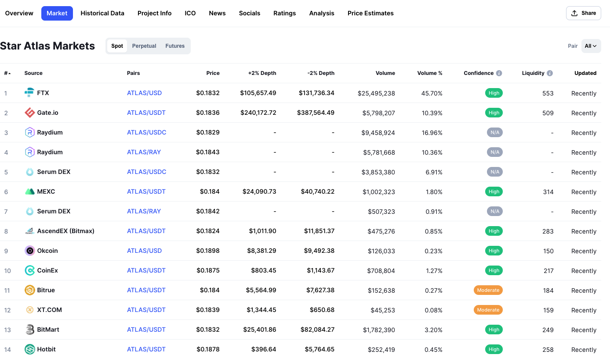

계속해서 신생 코인들이 출시되고 여기저기서 좋다고 추천하는 코인들은 많은데 막상 어디서 사는지 알기 쉽지 않습니다. 일일히 거래소들을 돌면서 찾아보는 것도 현실적으로 불가능하구요. 어떻게 하면 빠르게 원하는 코인들을 취급하는 거래소를 찾을 수 있을까요? 제가 사용하는 방법은 [coinmarketcap.com](https://coinmarketcap.com)에서 검색하고 [Gate.io](https://www.gate.io/ref/8719644)에서 구매하는 방법입니다. 아래에서 조금 더 자세하게 살펴볼게요.

코인마켓캡 웹사이트에서는 오른쪽 위의 search 기능을 사용해서 어느 페이지에서나 원하는 코인을 검색할 수 있습니다. 저는 요즘 P2E(play to earn)코인들에 관심이 많아서 새로나온 게임 코인인 Star Atlas를 검색해보았습니다.

그럼 이렇게 코인의 현재 가격과 간단한 설명이 나오는데 파란색으로 박스가 쳐진 Overview 바로 옆에 Market이라는 메뉴가 보이죠? 
Market 탭을 누르면 이 코인이 어디에서 거래가 가능한지 알려줍니다. 다른 탭들에도 좋은 정보가 많으니까 시간날 때 참고하세요.

제가 검색한 스타 아틀라스는 FTX, [Gate.io](https://www.gate.io/ref/8719644), Raydium 등에서 거래되고 있네요. 이 중에서 저는 [Gate.io](https://www.gate.io/ref/8719644)를 주로 이용합니다. 대형거래소에서 찾기 힘든 다양한 종류의 신생 코인들이 많이 있기때문에 주로 이용하는 편이에요. 신용카드로 결제하거나 은행을 연결해서 돈을 이체해도 되는데 저는 보통 다른 거래소에서 코인(주로 라이트코인)을 구매해서 게이트로 옮긴 후에 여기서 라이트 코인을 판매 후 다른 코인을 구매합니다^^ 거주지역에 따라서 가입이 안될수도 있으니 꼭 리서치를 먼저 하시길 바래요.

다음 글에서는 [Gate.io](https://www.gate.io/ref/8719644)에서 신생 코인 사는 조금 더 구체적인 방법을 다뤄볼까 합니다. 
