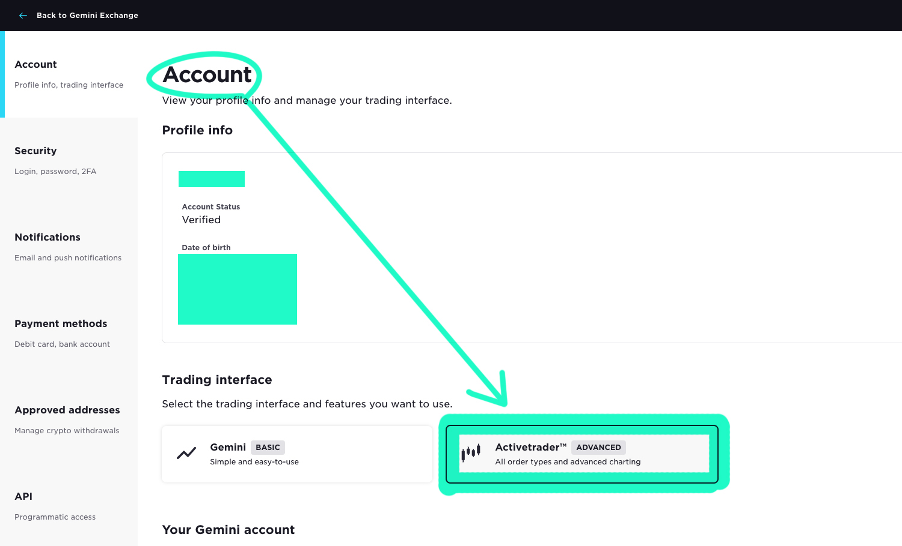
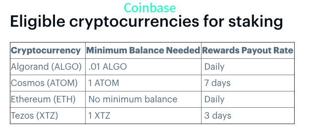
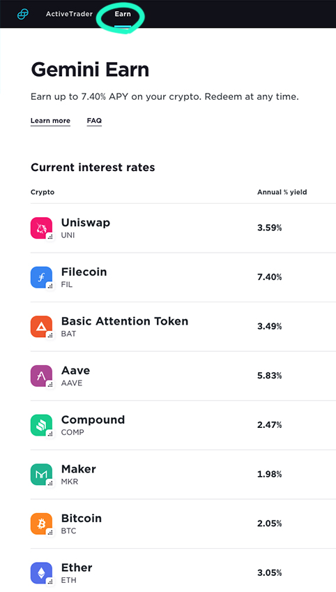

요즘 코인에 대한 관심처럼 코인거래소들도 많아지고 있는데 그 중에 어떤 거래소를 이용하면 좋을지 고민이신 분들께 제가 애용하는 거래소인 Gemini를 소개하고 간단한 장단점을 이야기해보려고 합니다. 클릭 한 번으로 수수료를 아낄 수 있는 방법도 알려드릴게요.

일단 **Gemini, 제미나이**는 페이스북을 다룬 영화 The Social Network 에서 마크 저크버그에게 처음 페이스북의 아이디어를 제공한 하버드 출신 쌍둥이 윙클보스 형제들이 페이스북을 상대로한 소송에서 승소한 돈으로 만든 코인거래소입니다^^

## 첫번째로 제미나이의 가장 큰 장점은 수수료가 비교적 저렴하다는 것.

얼마 전 상장을 해서 더 유명해진 코인베이스와 비교를 해보자면 코인 매매 수수료가 제미나이가 조금 더 저렴하고(코인베이스 프로가 0.5%, 제미나이는 0.35%) 코인별로 한달에 10번씩 withdraw 할때 수수료가 무료라는 엄청난 장점이 있습니다. Withdraw, 출금을 왜 하지? 생각하시는 분들도 계실텐데 코인을 팔아 현금화 하고싶진 않지만 다른 거래소나 개인 지갑으로 이동시키고 싶을때가 있는데 이럴때마다 출금 수수료가 0.5%나 되는 코인베이스는 너무 부담스러운게 사실입니다. 출금 수수료 0%인 곳과 0.5%인 곳은 차이가 엄청나죠? 제미나이의 가장 큰 장점중 하나라고 생각합니다.

## 두번째는 간편하게 내가 보유한 코인들을 빌려주고 이자를 받을 수 있다는 것.

코인베이스는 일반과 프로로 완전히 나뉘어져있고 일반은 입문자가 사용하기 친근하게 되어있지만 그 대신 코인 매매등의 수수료가 프로보다 훨씬 비싸다는 단점이 있습니다. 그래서 대개는 일반 코인베이스로 입문했다가 결국 코인베이스 프로로 갈아타게되는데 문제는 일반과 프로가 같은 계정으로 사용가능하지만 그 외의 기능은 다른 사이트라 제공하는 서비스가 완전히 달라 불편함이 있습니다.

코인거래소의 큰 장점중 하나가 내가 보유한 코인을 빌려주면 이자를 받을 수 있다는 건데 코인베이스 프로에는 이러한 기능이 없어서 이자를 받으려면 일반 코인베이스로 계속 코인을 옮겨줘야합니다. (정확하게 말하자면, 코인베이스의 이자는 돈을 빌려주는 것이 아니라 staking reward인데 이 부분은 나중에 설명해볼게요) 다행히 같은 회사라서 출금수수료는 내지 않아도 되지만 번거로운것은 사실이고 이자를 받을 수 있는 코인 종류도 현재 5가지로 매우 한정적입니다.

제미나이도 일반과 프로(엑티브 트레이더) 두가지 기능이 있는 것은 코인베이스와 동일하지만 따로 웹사이트가 나눠진게 아니고 같은 계정에서 셋팅만 바꿔서 사용이 가능하고 수수료가 훨씬 저렴한 엑티브 트레이더 셋팅상에서도 코인을 빌려주고 이자를 받을 수가 있어 편리합니다. 그리고 제미나이에서 거래하는 거의 모든 코인이 이자를 받을 수 있어서 단지 5가지의 코인만 이자를 받을 수 있는 코인베이스에 비하면 더 많은 이자를 받을 수도 있습니다.

보유하신 코인 빌려주고 이자를 받고 싶으시면 바로 Earn 탭을 눌러서 빌려주심됩니다. Filecoin 과 Dai 가 젤 많은 연 7.4% 이자를 줍니다^^ *코인을 빌려주는 것은 제미나이가 다른 업체와 제휴해서 제공하는 서비스라고 해요. 리스크가 있을 수 있으니 각자 잘 판단하시기 바랍니다.*

## Last but not least, 마지막으로 보안이 아주 철저하다는 것.

24시간마다 핸드폰 문자로 인증번호를 받아서 로그인해야하는데 좀 귀찮아도 이렇게 꼼꼼하게 관리하는게 코인을 안전하게 지킬수 있는 방법이기 때문에 저는 오히려 마음에 듭니다. 윙클보스 형제도 인터뷰마다 자신들은 보안을 최우선으로 한다고도 이야기하더라고요. 보안관련해서는 좀 더 안전하게 코인거래소 이용하는 법에대해 다음에 따로 글을 적어볼게요.

## 그럼 이렇게 좋은 제미나이의 단점은 무엇인가?

일단은 코인베이스등의 다른 거래소보다 **거래가능한 코인수가 적어요.** 하지만 비트코인, 이더리움, 라이트코인 등의 유명 코인들은 다 있고 점점 취급하는 코인수도 늘어나고 있어요. 인기있는 이더리움 기반 ERC-20 토큰은 다 있는 것 같아요. 얼마 전엔 온라인 게임 플랫폼인 Sandbox 코인도 추가되었습니다.

저는 예전에 바이낸스가 한번 해킹되었었다는 이야기를 들은 적이 있어서 아직 바이낸스는 이용안하고 미국에서 운영중인 **코인베이스랑 제미나이** 두곳을 이용하는데 수수료도 저렴하고 리밋바이도 간편한 제미나이를 주로 이용하고 제미나이에 없는 코인들만(Ada, Atom 등) 코인베이스에서 구매합니다. 리밋바이에 대해서도 다음에 글 따로 올려볼게요.

제미나이 계정이 아직 없으신 분들은 가입 후 30일내에 100불 이상 거래하면 양쪽 다 비트코인 $10씩 받는 제 리퍼럴 링크도 남길게요.

https://www.gemini.com/share/4qgkrzkcl

제미나이에 없는 코인들을 구매하실때 좋은 코인베이스도 역시 양쪽 모두 비트코인 $10씩 받을 수 있는 리퍼럴 링크가 있습니다.

https://www.coinbase.com/join/lee_s5c9

